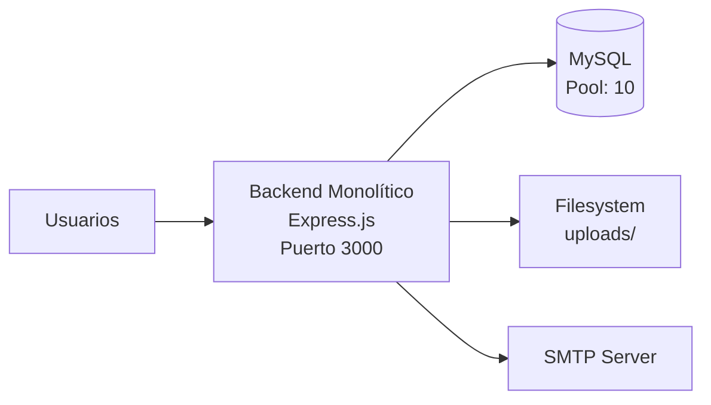
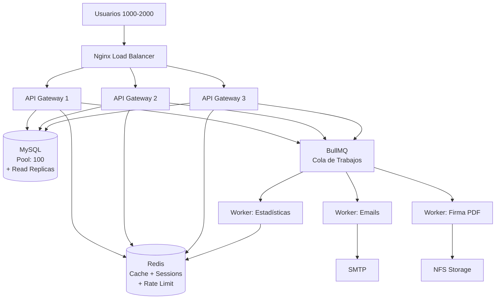

# 🔬 Análisis de Estrés: Sistema GDE — 1000/2000 Usuarios Concurrentes

## Veredicto Ejecutivo

> [!CAUTION]
> **El sistema NO está preparado** para soportar 1000-2000 usuarios concurrentes en su estado actual. Se identificaron **12 cuellos de botella críticos** que provocarían caídas, tiempos de espera inaceptables y agotamiento de recursos bajo carga real.

**Capacidad estimada actual:** ~50-80 usuarios concurrentes activos antes de degradación severa.

---

## 📊 Mapa de Cuellos de Botella Identificados

| # | Categoría | Severidad | Archivo(s) Afectado(s) | Impacto en 1000 usuarios |
|---|-----------|-----------|------------------------|--------------------------|
| 1 | Pool MySQL = 10 conexiones | 🔴 CRÍTICO | [db.js](file:///home/jovillafane/Descargas/Sistema_Documental_JS/gde_backend/config/db.js) | Cola infinita, timeouts masivos |
| 2 | `SELECT *` sin paginación | 🔴 CRÍTICO | [docController.js](file:///home/jovillafane/Descargas/Sistema_Documental_JS/gde_backend/controllers/docController.js#L52-L78), [expController.js](file:///home/jovillafane/Descargas/Sistema_Documental_JS/gde_backend/controllers/expController.js#L44-L81) | OOM / responses de 50MB+ |
| 3 | Dashboard: 14 queries por request | 🔴 CRÍTICO | [systemController.js](file:///home/jovillafane/Descargas/Sistema_Documental_JS/gde_backend/controllers/systemController.js#L108-L304) | Satura pool con 70 usuarios |
| 4 | Crypto síncrono (fs.readFileSync) | 🟠 ALTO | [cryptoService.js](file:///home/jovillafane/Descargas/Sistema_Documental_JS/gde_backend/services/cryptoService.js#L52-L68), [signatureService.js](file:///home/jovillafane/Descargas/Sistema_Documental_JS/gde_backend/services/signatureService.js#L6-L31) | Bloquea Event Loop |
| 5 | signFinalAndSeal: 5 fases bloqueantes | 🟠 ALTO | [docController.js](file:///home/jovillafane/Descargas/Sistema_Documental_JS/gde_backend/controllers/docController.js#L402-L508) | 1 firma = 3-10 seg blocking |
| 6 | Emails síncronos en request | 🟠 ALTO | [notificationController.js](file:///home/jovillafane/Descargas/Sistema_Documental_JS/gde_backend/controllers/notificationController.js#L56-L72) | Timeout por SMTP lento |
| 7 | Monolito single-process | 🟠 ALTO | [server.js](file:///home/jovillafane/Descargas/Sistema_Documental_JS/gde_backend/server.js) | 1 CPU, sin clustering |
| 8 | Rate limiter en memoria | 🟡 MEDIO | [rateLimiter.js](file:///home/jovillafane/Descargas/Sistema_Documental_JS/gde_backend/middlewares/rateLimiter.js) | No funciona con múltiples instancias |
| 9 | Sin índices en `history` | 🟡 MEDIO | [setup_full.js](file:///home/jovillafane/Descargas/Sistema_Documental_JS/gde_backend/setup_full.js#L98-L109) | Full table scans con N+1 |
| 10 | Notificaciones: N+1 queries | 🟡 MEDIO | [notificationController.js](file:///home/jovillafane/Descargas/Sistema_Documental_JS/gde_backend/controllers/notificationController.js#L14-L21) | Query por cada destinatario |
| 11 | Sin caché de ningún tipo | 🟡 MEDIO | Global | Cada request = query completa |
| 12 | Logs a disco síncrono | 🟢 BAJO | [logger.js](file:///home/jovillafane/Descargas/Sistema_Documental_JS/gde_backend/utils/logger.js) | I/O adicional bajo carga |

---

## 🔴 Análisis Detallado por Categoría

### 1. Base de Datos — El Cuello de Botella Principal

#### 1.1 Pool de Conexiones = 10 (Línea 12, db.js)

```javascript
// ACTUAL — Colapsa con 50+ usuarios activos
connectionLimit: 10,
queueLimit: 0  // Cola infinita = memoria infinita
```

**Problema:** Con 1000 usuarios, si cada request usa 1 conexión ~50ms, solo puedes servir ~200 req/s. Con `queueLimit: 0`, las peticiones se encolan sin límite → el servidor se queda sin RAM.

**Solución propuesta:**
```javascript
// PROPUESTO — Escalable a 1000-2000 usuarios
connectionLimit: 100,        // 100 conexiones simultáneas
queueLimit: 500,             // Máximo 500 en cola antes de rechazar
waitForConnections: true,
acquireTimeout: 10000,       // Timeout de 10s para obtener conexión
enableKeepAlive: true,
keepAliveInitialDelay: 30000
```

#### 1.2 `getAllDocuments` y `getAllExpedientes` — Sin paginación

```javascript
// ACTUAL — Carga TODOS los documentos + TODO el historial en RAM
const [docs] = await pool.query('SELECT * FROM documents');
const [history] = await pool.query("SELECT * FROM history WHERE item_type = 'documento'");
```

**Problema:** Con 10,000 documentos y 50,000 registros de historial, cada request genera un payload de ~30-50MB. Si 100 usuarios piden esto simultáneamente = **3-5 GB de RAM** solo para responses.

**Solución propuesta:**
- Paginación con `LIMIT/OFFSET` o cursores
- Endpoint `/api/docs?page=1&limit=50&status=Borrador`
- El historial NO debería viajar con todos los documentos — endpoint separado `/api/docs/:id/history`
- Proyección de columnas: no traer `content` en el listado, solo en detalle

#### 1.3 Sin índices en tablas críticas

**Tabla `history`** (la más consultada): no tiene índices en `item_id`, `item_type`, `action`, ni `created_at`.

```sql
-- PROPUESTO: Índices esenciales
ALTER TABLE history ADD INDEX idx_history_item (item_id, item_type);
ALTER TABLE history ADD INDEX idx_history_created (created_at);
ALTER TABLE history ADD INDEX idx_history_action (action);
ALTER TABLE documents ADD INDEX idx_docs_status (status);
ALTER TABLE documents ADD INDEX idx_docs_creator (creator_id);
ALTER TABLE documents ADD INDEX idx_docs_owner (current_owner_id);
ALTER TABLE notifications ADD INDEX idx_notif_user (user_id, is_read);
ALTER TABLE notifications ADD INDEX idx_notif_created (created_at);
```

---

### 2. I/O y Criptografía — Bloqueo del Event Loop

#### 2.1 Operaciones de archivo síncronas

En `cryptoService.js` y `signatureService.js`:

```javascript
// BLOQUEA el Event Loop completo mientras lee/escribe
fs.writeFileSync(filePath, fileData);  // cryptoService L48
fs.readFileSync(filePath);              // cryptoService L55
fs.readFileSync(p12Path);              // signatureService L9
```

**Problema:** Node.js es single-threaded. Cada `readFileSync` de un PDF de 5MB bloquea TODAS las requests durante ~20-50ms. Con 50 descargas simultáneas = 1-2.5 segundos de bloqueo total.

**Solución propuesta:**
- Reemplazar con `fs.promises.readFile()` y `fs.promises.writeFile()` (async)
- Para operaciones criptográficas pesadas: usar `worker_threads` de Node.js

#### 2.2 `signFinalAndSeal` — La función más costosa

Esta función ejecuta 5 fases secuenciales y pesadas en un solo request:
1. Lee PDF del disco
2. Desencripta cada adjunto y los embebe en el PDF (bucle con `readFileSync`)
3. Firma criptográfica PKCS#7
4. Calcula hash SHA-256 + encripta el PDF final
5. Escribe al disco + actualiza BD

**Problema:** Un documento con 3 adjuntos de 5MB puede tardar 3-10 segundos bloqueando el thread principal. **2 firmas simultáneas = sistema paralizado.**

**Solución propuesta:**
- Mover a un **Worker Service** dedicado (microservicio de firma)
- El endpoint solo encola el trabajo y devuelve un `jobId`
- El frontend consulta el estado con polling o WebSockets
- Alternativa inmediata: usar `worker_threads` para la criptografía pesada

---

### 3. Dashboard de Estadísticas — 14 Queries por Request

El endpoint `getDashboardStats` ejecuta **14 queries SQL separadas** en cada invocación:

| Query | Propósito |
|-------|-----------|
| 1 | `COUNT(*)` total documentos |
| 2 | Firmados hoy (history) |
| 3 | Total firmados |
| 4 | Pendientes de revisión |
| 5 | Documentos por tipo (GROUP BY) |
| 6 | Timeline de firmas (GROUP BY DATE) |
| 7-9 | Firmas: 5min, 1h, hoy |
| 10-12 | Uploads: 5min, 1h, hoy |
| 13-15 | Descargas: 5min, 1h, hoy |
| 16 | Usuarios online |
| 17 | Actividad reciente (JOIN + subqueries) |
| 18 | Eficiencia de procesos (subquery correlacionada) |
| 19 | Documentos stuck |
| 20 | Documentos por estado |

**Problema:** 14-20 queries × 1000 usuarios refrescando dashboard = **14,000-20,000 queries/refresh**. Si el dashboard se refresca cada 30 seg → ~500,000 queries/minuto. El pool de 10 conexiones colapsa instantáneamente.

**Solución propuesta:**
- **Caché con Redis** (TTL de 30-60 seg para métricas)
- Consolidar queries en 3-4 queries SQL optimizadas con múltiples aggregaciones
- Endpoint de métricas en tiempo real vía **WebSockets** (no polling HTTP)
- Separar en microservicio de estadísticas que pre-calcula métricas

---

### 4. Notificaciones y Email — Modelo Bloqueante

#### 4.1 N+1 en expansión de destinatarios

```javascript
// ACTUAL: Una query por cada área destinataria
for (let id of userIds) {
    if (id.startsWith('a')) {
        const [users] = await pool.query('SELECT id FROM users WHERE area_id = ?...', [id]);
    }
}
```

#### 4.2 Envío de emails síncrono en el request

```javascript
// ACTUAL: El request espera a que CADA email se envíe
emailRecipients.forEach(u => {
    emailService.sendMail(u.email, mailSubject, message, mailHtml);
});
```

**Problema:** Si una notificación va a 3 áreas con 100 usuarios = 300 emails. Si cada email tarda ~200ms → 60 segundos solo en emails. El request hace timeout.

**Solución propuesta:**
- **Cola de mensajes** con BullMQ + Redis para emails
- El endpoint solo encola los emails y responde inmediato
- Un worker separado procesa la cola de emails en background
- Batch de expansión de áreas en una sola query SQL

---

### 5. Arquitectura — Monolito Single-Process

#### 5.1 Sin clustering de Node.js

```javascript
// ACTUAL: Un solo proceso, un solo CPU core
app.listen(PORT, () => {
    console.log(`Servidor corriendo en el puerto ${PORT}`);
});
```

**Problema:** Node.js usa 1 solo core de CPU. En un servidor con 8 cores, desperdicias el 87.5% del hardware.

#### 5.2 Rate Limiter en memoria local

```javascript
// ACTUAL: Almacena contadores en RAM del proceso
const apiLimiter = rateLimit({ windowMs: 15 * 60 * 1000, max: 200 });
```

**Problema:** Con Docker Swarm (3 réplicas), cada réplica tiene su propio contador. Un atacante puede hacer 200 × 3 = 600 requests.

**Solución propuesta:**
- `rate-limit-redis` para compartir contadores entre instancias
- PM2 cluster mode o Node.js `cluster` module para usar todos los cores
- Health check endpoint `/api/health` para load balancer

---

## 🏗️ Propuesta de Arquitectura: Microservicios

### Arquitectura Actual (Monolito)



### Arquitectura Propuesta (Microservicios)



### 5 Servicios Propuestos

| Servicio | Responsabilidad | Por qué separarlo |
|----------|----------------|-------------------|
| **API Gateway** (×3 réplicas) | Auth, CRUD docs, validación | Escala horizontal, stateless |
| **Worker de Firma** (×2) | signFinalAndSeal, crypto | CPU-intensive, bloquea Event Loop |
| **Worker de Email** (×1) | Envío SMTP, templates | I/O-bound, tolerante a latencia |
| **Worker de Stats** (×1) | Pre-calcula dashboard metrics | Queries pesadas, resultado cacheable |
| **Redis** | Cache, rate limit, colas, sesiones | Compartido entre todas las instancias |

---

## 📋 Plan de Implementación por Fases

### Fase 1 — Quick Wins (Impacto inmediato, sin cambiar arquitectura)
**Tiempo estimado: 1-2 días**

| Cambio | Archivo | Impacto |
|--------|---------|---------|
| Pool MySQL → 50-100 conexiones | `config/db.js` | ×10 throughput DB |
| Agregar índices SQL | `setup_full.js` / migración | Queries 10-100× más rápidas |
| Paginación en getAllDocuments | `docController.js` | Reduce RAM 95% |
| Paginación en getAllExpedientes | `expController.js` | Reduce RAM 95% |
| Limitar `queueLimit` a 500 | `config/db.js` | Previene OOM |

### Fase 2 — Eliminar Bloqueos Síncronos
**Tiempo estimado: 2-3 días**

| Cambio | Archivo | Impacto |
|--------|---------|---------|
| `fs.readFileSync` → `fs.promises` | `cryptoService.js`, `signatureService.js` | Libera Event Loop |
| `fs.writeFileSync` → `fs.promises` | `cryptoService.js` | Libera Event Loop |
| Clustering con PM2 o `cluster` module | `server.js` | Usa todos los CPU cores |
| Consolidar queries del dashboard | `systemController.js` | De 14 a 4-5 queries |

### Fase 3 — Introducir Redis
**Tiempo estimado: 3-4 días**

| Cambio | Archivo | Impacto |
|--------|---------|---------|
| Cache de dashboard stats (TTL 30s) | `systemController.js` | -95% queries de stats |
| Cache de `getInitialData` (TTL 60s) | `systemController.js` | Areas/users no cambian seguido |
| Rate limiter con Redis store | `rateLimiter.js` | Funciona multi-instancia |
| Cache de sesiones JWT (blacklist) | `authMiddleware.js` | Logout real, invalidación |

### Fase 4 — Cola de Trabajos (BullMQ)
**Tiempo estimado: 4-5 días**

| Cambio | Archivo | Impacto |
|--------|---------|---------|
| Email worker con BullMQ | `services/emailService.js` + nuevo worker | Emails no bloquean requests |
| Firma PDF como job asíncrono | `docController.js` + nuevo worker | Firmas no bloquean API |
| Endpoint de estado de job | Nuevo controller | Frontend consulta progreso |
| Notificaciones en background | `notificationController.js` | Response instantáneo |

### Fase 5 — Separación de Servicios (Docker Compose)
**Tiempo estimado: 5-7 días**

| Cambio | Impacto |
|--------|---------|
| Dockerfile para API Gateway | Escalable ×N réplicas |
| Dockerfile para Workers | Escalable independiente |
| docker-compose con Redis + workers | Orquestación completa |
| Health checks + graceful shutdown | Zero-downtime deploys |
| WebSockets para dashboard real-time | Elimina polling |

---

## 📈 Proyección de Capacidad por Fase

| Fase | Usuarios Concurrentes | Latencia p95 | Disponibilidad |
|------|----------------------|--------------|----------------|
| **Actual** | ~50-80 | 2-5 seg | ~95% |
| **Fase 1** (Pool + Índices + Paginación) | ~200-400 | 500ms-1s | ~97% |
| **Fase 2** (Async I/O + Clustering) | ~500-800 | 200-500ms | ~98% |
| **Fase 3** (Redis Cache) | ~800-1200 | 100-300ms | ~99% |
| **Fase 4** (Colas de Trabajo) | ~1200-1800 | 80-200ms | ~99.5% |
| **Fase 5** (Microservicios) | ~2000-5000+ | 50-150ms | ~99.9% |

---

## 🧪 Plan de Verificación (Stress Testing)

Para validar cada fase, usar **Artillery** o **k6**:

```bash
# Instalar Artillery
npm install -g artillery

# Test básico: 100 usuarios virtuales durante 60 segundos
artillery quick --count 100 --num 50 http://localhost:3000/api/docs/all

# Test de carga progresiva (archivo YAML)
artillery run stress-test.yml
```

Escenarios sugeridos para cada fase:
1. **Login masivo**: 500 logins simultáneos con 2FA
2. **Lectura de documentos**: 1000 GET /api/docs/all concurrentes
3. **Firma bajo carga**: 50 firmas simultáneas de PDFs con adjuntos
4. **Dashboard**: 200 usuarios refrescando dashboard cada 10 seg
5. **Notificaciones masivas**: Notificación a 500 usuarios simultáneamente

---

## ⚠️ Decisiones que Requieren tu Input

> [!IMPORTANT]
> **1. ¿Prioridad de fases?** ¿Prefieres empezar por la Fase 1 (quick wins) y avanzar gradualmente, o hay alguna fase que consideres más urgente?

> [!IMPORTANT]
> **2. ¿Redis es viable?** ¿Tienes infraestructura para correr Redis (puede ser en el mismo servidor o en Docker)? Es el cambio con mejor relación costo/beneficio.

> [!IMPORTANT]
> **3. ¿Cuántos usuarios reales esperás a corto plazo?** Si son ~200-500, con las Fases 1 y 2 alcanza. Si necesitás 1000+ inmediatamente, hay que ir directo a Fase 3-4.

> [!IMPORTANT]
> **4. ¿Frontend SPA o seguir con vanilla?** El frontend actual (272KB en un solo `app.js`) también necesitará optimización si se espera carga alta (code splitting, lazy loading).
