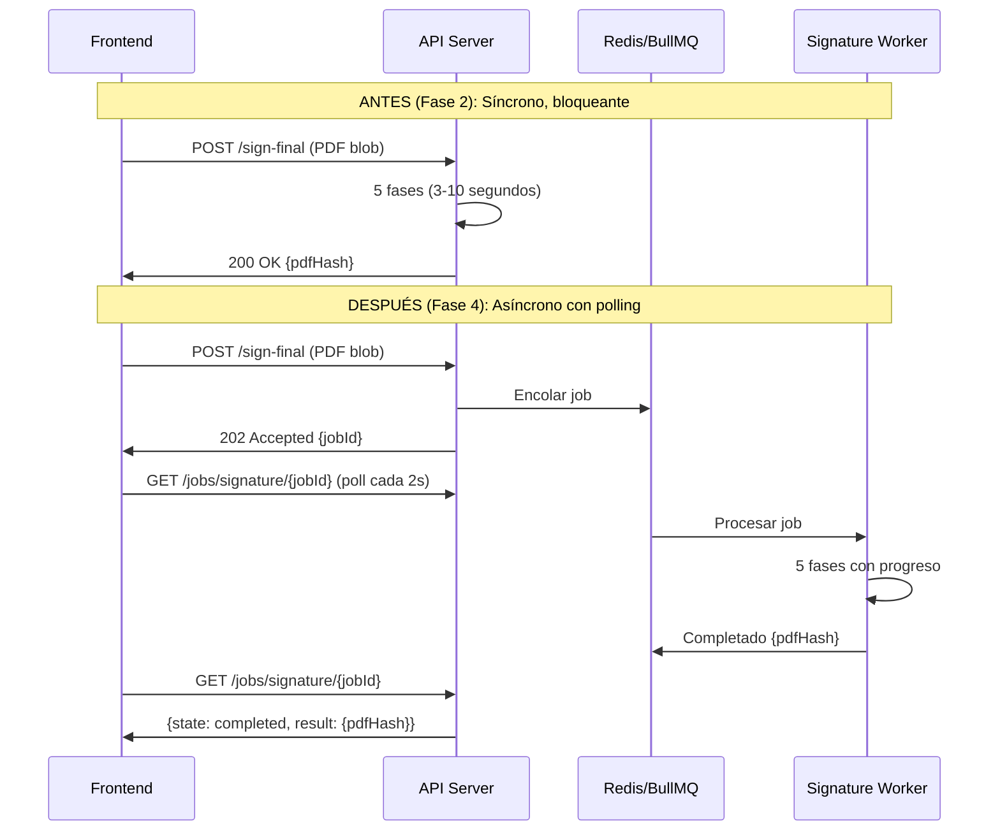

# Walkthrough — Fases 3 y 4: Redis + BullMQ

## Resumen

Se completaron las Fases 3 y 4 del roadmap de escalabilidad GDE, integrando:

- **Fase 3 (Redis):** Cache de dashboard/initialData, rate limiting distribuido, blacklist JWT para logout real
- **Fase 4 (BullMQ):** Emails procesados en background, firma PDF asíncrona con workers dedicados, polling de estado desde frontend

---

## Archivos Creados y Modificados

### Fase 3 — Redis

| Acción | Archivo | Cambio |
|--------|---------|--------|
| **NUEVO** | [redisClient.js](file:///home/jovillafane/Descargas/Sistema_Documental_JS/gde_backend/config/redisClient.js) | Cliente Redis singleton con retry y logging |
| MOD | [systemController.js](file:///home/jovillafane/Descargas/Sistema_Documental_JS/gde_backend/controllers/systemController.js) | Cache dashboard (30s) + initialData (60s) |
| MOD | [rateLimiter.js](file:///home/jovillafane/Descargas/Sistema_Documental_JS/gde_backend/middlewares/rateLimiter.js) | RedisStore por limiter con prefijo único |
| MOD | [authMiddleware.js](file:///home/jovillafane/Descargas/Sistema_Documental_JS/gde_backend/middlewares/authMiddleware.js) | Check blacklist JWT antes de verify |
| MOD | [authController.js](file:///home/jovillafane/Descargas/Sistema_Documental_JS/gde_backend/controllers/authController.js) | Endpoint `logout()` con blacklist Redis |
| MOD | [authRoutes.js](file:///home/jovillafane/Descargas/Sistema_Documental_JS/gde_backend/routes/authRoutes.js) | `POST /api/auth/logout` |
| MOD | [userController.js](file:///home/jovillafane/Descargas/Sistema_Documental_JS/gde_backend/controllers/userController.js) | `invalidateInitialDataCache()` en mutaciones |
| MOD | [areaController.js](file:///home/jovillafane/Descargas/Sistema_Documental_JS/gde_backend/controllers/areaController.js) | `invalidateInitialDataCache()` en mutaciones |
| MOD | [.env](file:///home/jovillafane/Descargas/Sistema_Documental_JS/gde_backend/.env) + [.env.example](file:///home/jovillafane/Descargas/Sistema_Documental_JS/gde_backend/.env.example) | Variables `REDIS_*` |

### Fase 4 — BullMQ

| Acción | Archivo | Cambio |
|--------|---------|--------|
| **NUEVO** | [queues.js](file:///home/jovillafane/Descargas/Sistema_Documental_JS/gde_backend/config/queues.js) | Colas `gde-email` y `gde-signature` |
| **NUEVO** | [emailWorker.js](file:///home/jovillafane/Descargas/Sistema_Documental_JS/gde_backend/workers/emailWorker.js) | Worker SMTP con pool, 5x concurrency, rate limit 30/min |
| **NUEVO** | [signatureWorker.js](file:///home/jovillafane/Descargas/Sistema_Documental_JS/gde_backend/workers/signatureWorker.js) | Worker firma PDF (5 fases), 2x concurrency, progreso |
| **NUEVO** | [jobController.js](file:///home/jovillafane/Descargas/Sistema_Documental_JS/gde_backend/controllers/jobController.js) | Endpoint estado de jobs con whitelist de colas |
| **NUEVO** | [jobRoutes.js](file:///home/jovillafane/Descargas/Sistema_Documental_JS/gde_backend/routes/jobRoutes.js) | `GET /api/jobs/:queueName/:jobId` |
| MOD | [emailService.js](file:///home/jovillafane/Descargas/Sistema_Documental_JS/gde_backend/services/emailService.js) | `sendMail()` encola en BullMQ con fallback directo |
| MOD | [docController.js](file:///home/jovillafane/Descargas/Sistema_Documental_JS/gde_backend/controllers/docController.js) | `signFinalAndSeal` → HTTP 202 + jobId |
| MOD | [server.js](file:///home/jovillafane/Descargas/Sistema_Documental_JS/gde_backend/server.js) | Workers + jobRoutes registration |
| MOD | [app.js](file:///home/jovillafane/Descargas/Sistema_Documental_JS/gde_frontend/app.js) | `clearSession()` async con logout, `pollJobStatus()`, firma con polling |
| MOD | [docker_swarm_architecture.md](file:///home/jovillafane/Descargas/Sistema_Documental_JS/docker_swarm_architecture.md) | Redis con AOF en compose |

---

## Dependencias Instaladas

```diff
+ ioredis@5.x            — Cliente Redis (Fase 3)
+ rate-limit-redis@4.3.1 — Store Redis para express-rate-limit v7 (Fase 3)
+ bullmq@5.x             — Cola de trabajos con workers (Fase 4)
```

---

## Bugs Resueltos en Runtime

### 1. `ERR_ERL_STORE_REUSE` (Fase 3)
`express-rate-limit v7` no permite compartir `RedisStore` entre limiters. Se creó `createRedisStore(prefix)` con prefijo único por limiter.

### 2. `Queue name cannot contain :` (Fase 4)
BullMQ usa `:` internamente como separador. Los nombres `gde:email` y `gde:signature` fueron cambiados a `gde-email` y `gde-signature`.

---

## Arquitectura de Firma Async (Antes vs Después)



---

## Validación

Todos los módulos cargan correctamente y Redis conectó:
```
OK queues.js
OK emailWorker.js (📧 Email Worker iniciado)
OK signatureWorker.js (✍️  Signature Worker iniciado)
OK jobController.js
OK jobRoutes.js
OK emailService.js
OK docController.js
OK rateLimiter.js
OK authMiddleware.js
OK authController.js
OK authRoutes.js
queues exports: emailQueue, signatureQueue, connection
jobController.getJobStatus: function
docController.signFinalAndSeal: function
✅ Redis conectado
```

---

## Proyección de Capacidad Actualizada

| Fase | Usuarios Concurrentes | Estado |
|------|----------------------|--------|
| Fase 1 (Pool + Índices) | ~200-400 | ✅ |
| Fase 2 (Async I/O + Clustering) | ~500-800 | ✅ |
| Fase 3 (Redis Cache) | ~800-1200 | ✅ |
| **Fase 4 (BullMQ Workers)** | **~1200-1800** | **✅ Completada** |
| Fase 5 (Microservicios) | ~2000-5000+ | Pendiente |
