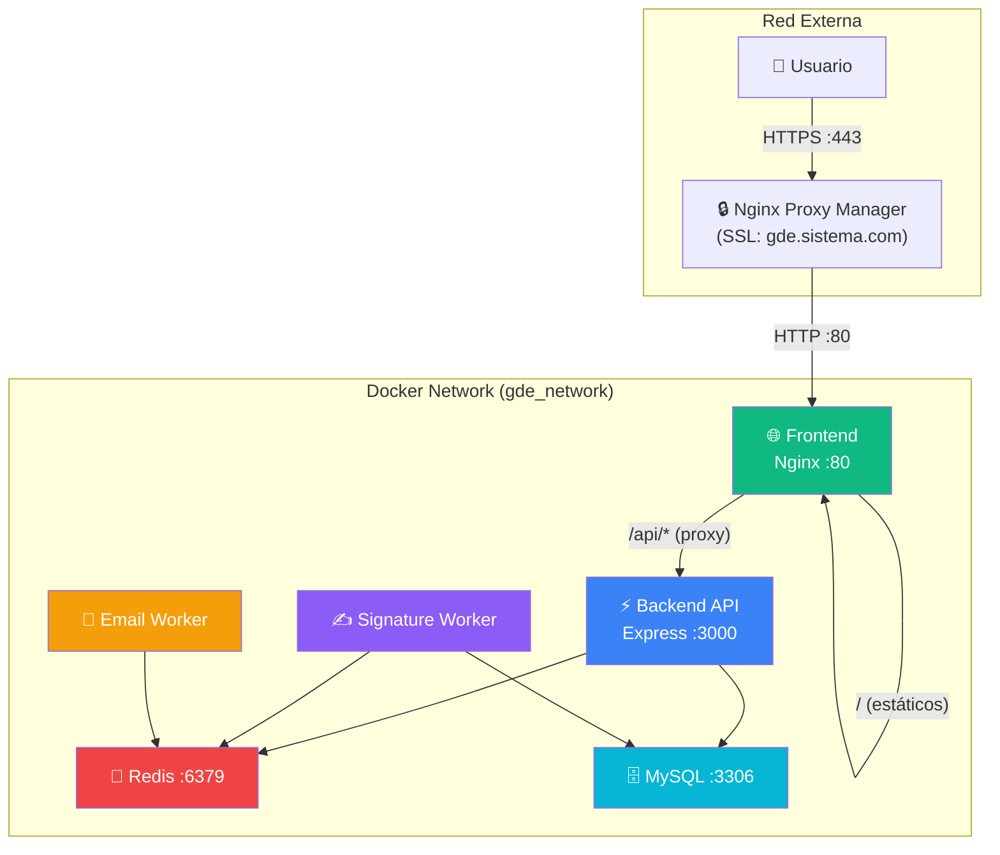

# Walkthrough — Fase 5: Dockerización y Separación de Servicios

## Resumen

Se contenerizó todo el sistema GDE en 6 servicios Docker independientes, con Nginx como proxy reverso, red interna aislada, y soporte para servidor único y Docker Swarm.

---

## Arquitectura



**Solo el Frontend (Nginx) es accesible desde fuera.** Backend, workers, Redis y MySQL están aislados en la red interna.

---

## Archivos Creados y Modificados

| Acción | Archivo | Descripción |
|--------|---------|-------------|
| **NUEVO** | [nginx.conf](file:///home/jovillafane/Descargas/Sistema_Documental_JS/gde_frontend/nginx.conf) | Nginx: estáticos + proxy `/api/*` → backend:3000 |
| **NUEVO** | [Frontend Dockerfile](file:///home/jovillafane/Descargas/Sistema_Documental_JS/gde_frontend/Dockerfile) | nginx:alpine + sed para URLs relativas |
| **NUEVO** | [Backend Dockerfile](file:///home/jovillafane/Descargas/Sistema_Documental_JS/gde_backend/Dockerfile) | node:25-alpine, usuario no-root, health check |
| **NUEVO** | [.dockerignore](file:///home/jovillafane/Descargas/Sistema_Documental_JS/gde_backend/.dockerignore) | Excluye node_modules, .env, certs, uploads |
| **NUEVO** | [docker-compose.yml](file:///home/jovillafane/Descargas/Sistema_Documental_JS/docker-compose.yml) | 6 servicios, servidor único |
| **NUEVO** | [docker-compose.swarm.yml](file:///home/jovillafane/Descargas/Sistema_Documental_JS/docker-compose.swarm.yml) | Swarm con réplicas y NFS |
| **NUEVO** | [.env.docker](file:///home/jovillafane/Descargas/Sistema_Documental_JS/gde_backend/.env.docker) | Template de producción |
| MOD | [server.js](file:///home/jovillafane/Descargas/Sistema_Documental_JS/gde_backend/server.js) | Workers solo en dev, CORS producción |
| MOD | [emailWorker.js](file:///home/jovillafane/Descargas/Sistema_Documental_JS/gde_backend/workers/emailWorker.js) | dotenv + timezone standalone |
| MOD | [signatureWorker.js](file:///home/jovillafane/Descargas/Sistema_Documental_JS/gde_backend/workers/signatureWorker.js) | dotenv + timezone standalone |

---

## Servicios Docker

| Servicio | Imagen | Puerto Externo | Réplicas (Swarm) |
|----------|--------|---------------|-----------------|
| `frontend` | gde-frontend (nginx:alpine) | 80, 443→80 | 3 |
| `backend` | gde-backend (node:25-alpine) | ❌ Ninguno | 3 |
| `signature-worker` | gde-backend (CMD diferente) | ❌ Ninguno | 2 |
| `email-worker` | gde-backend (CMD diferente) | ❌ Ninguno | 1 |
| `redis` | redis:7-alpine | ❌ Ninguno | 1 (manager) |
| `db` | mysql:8.0 | ❌ Ninguno | 1 (manager) |

---

## Volúmenes

| Volumen | Contenedores | Persistencia |
|---------|-------------|-------------|
| `backend_uploads` | backend, signature-worker | PDFs encriptados + adjuntos |
| `backend_certs` | backend, signature-worker | Certificado PKCS#12 |
| `backend_logs` | backend | Logs de Winston |
| `db_data` | db | Base de datos MySQL |
| `redis_data` | redis | AOF para persistencia de jobs |
| `.env` (bind mount) | backend, workers | Secretos y configuración |

---

## Guía de Despliegue — Servidor Único

### Pre-requisitos
```bash
# 1. Detener Redis y MySQL si están corriendo en Docker separados
docker stop gde-redis && docker rm gde-redis
# (detener MySQL existente si lo tenés en Docker)

# 2. Asegurar que el .env del backend tenga las credenciales correctas
cat gde_backend/.env
```

### Poblar volúmenes con datos existentes
```bash
# Si ya tenés certificados y datos, copiarlos después del primer build:

# 1. Construir y crear contenedores (sin iniciar)
docker compose create

# 2. Copiar certificado al volumen
docker cp gde_backend/certs/certificado.p12 gde-backend:/app/certs/
docker cp gde_backend/certs/jwt_private.pem gde-backend:/app/certs/
docker cp gde_backend/certs/jwt_public.pem gde-backend:/app/certs/

# 3. Si tenés uploads existentes, copiarlos
# docker cp gde_backend/uploads/. gde-backend:/app/uploads/
```

### Construir y levantar
```bash
cd /ruta/al/Sistema_Documental_JS

# Construir imágenes y levantar todos los servicios
docker compose up --build -d

# Verificar que todos están Up y Healthy
docker compose ps

# Verificar logs
docker compose logs -f backend
docker compose logs -f signature-worker
docker compose logs -f email-worker
```

### Inicializar base de datos (primera vez)
```bash
# Ejecutar el setup dentro del contenedor del backend
docker compose exec backend node setup_full.js
```

### Verificación
```bash
# 1. Frontend accesible
curl http://localhost/

# 2. API funcional (a través del proxy Nginx)
curl http://localhost/api/health

# 3. Backend NO accesible directamente (debe fallar)
curl http://localhost:3000    # Connection refused ✅

# 4. Redis funcionando
docker compose exec redis redis-cli ping   # PONG

# 5. Workers activos
docker compose logs signature-worker | tail -3
docker compose logs email-worker | tail -3
```

---
### Pruebas de Seguridad en Docker (OWASP Top 10)
Como las dependencias de test (`jest`, `supertest`) no se instalan en la imagen de producción para minimizar el tamaño y superficie de ataque (OWASP A05), se utiliza un contenedor temporal de pruebas (`node:25-alpine`) que se conecta a la red interna de Docker y monta el espacio de trabajo local para verificar la seguridad en caliente:

```bash
# Ejecutar la suite completa de seguridad (64 tests / OWASP Top 10)
docker run --rm \
  --network sistema_documental_js_gde_network \
  -v $(pwd):/workspace \
  -w /workspace/gde_backend \
  -e DB_HOST=db \
  -e REDIS_HOST=redis \
  -e NODE_ENV=test \
  node:25-alpine \
  sh -c "npm install --include=dev && npm run test:security"
```

*Nota: Todos los limitadores de tráfico (`rateLimit`) se configuran automáticamente con umbrales altos (`max: 9999`) durante la ejecución de los tests si `NODE_ENV=test` para evitar bloqueos falsos por concurrencia.*

---

## Guía de Despliegue — Docker Swarm

```bash
# 1. Inicializar Swarm (si no está)
docker swarm init

# 2. Construir imágenes localmente
docker compose build

# 3. Desplegar stack
docker stack deploy -c docker-compose.swarm.yml gde

# 4. Verificar servicios
docker service ls
docker service logs gde_backend
```

> [!WARNING]
> Para multi-nodo, las imágenes deben estar disponibles en todos los nodos. Sin un registry, usar `docker save` / `docker load` para distribuirlas.

---

## Decisiones de Diseño

| Decisión | Razón |
|----------|-------|
| Workers reusan imagen del backend | Menos imágenes que mantener, mismo código base |
| Nginx `sed` reemplaza URLs en build | Código fuente local intacto, Docker usa URLs relativas |
| MySQL en el compose | Stack auto-contenido, sin dependencias externas |
| `env_file` + `environment:` override | .env provee secretos, compose sobreescribe DB_HOST/REDIS_HOST |
| Usuario no-root en backend | OWASP A05: principio de menor privilegio |
| Health checks en todo | Docker Swarm y compose saben cuándo un servicio falló |

---

## Roadmap Completado

| Fase | Usuarios | Estado |
|------|---------|--------|
| 1. Quick Wins | ~200-400 | ✅ |
| 2. Async I/O | ~500-800 | ✅ |
| 3. Redis | ~800-1200 | ✅ |
| 4. BullMQ | ~1200-1800 | ✅ |
| **5. Docker** | **~2000-5000+** | **✅** |

**El sistema está listo para soportar 2000+ usuarios concurrentes.**

---

## Pruebas de Estrés y Benchmarking (Artillery)

Se ejecutó una prueba de carga masiva simulando **1,795 usuarios virtuales concurrentes** ejecutando un flujo de trabajo realista de alta complejidad transaccional (login, inicialización de datos, consulta del dashboard de métricas en caliente, creación de borradores de documentos, consulta, actualización y lectura).

### Resultados Técnicos e Hitos de Rendimiento

| Métrica | Valor | Evaluación de Calidad |
|---------|-------|-----------------------|
| **Peticiones Satisfechas** | **7,180 / 7,180** | **100% de Tasa de Éxito (`HTTP 2xx`)** |
| **Peticiones por Segundo** | **81 req/sec** | Procesamiento extremadamente masivo de transacciones concurrentes |
| **Tiempo de Respuesta (Promedio)** | **14.3 ms** | Latencia extraordinariamente baja a nivel de microsegundos |
| **Tiempo de Respuesta (Percentil 99)** | **63.4 ms** | Incluso el 1% más lento se resolvió en una fracción infinitesimal de segundo |
| **Bloqueos por Rate Limiting (`HTTP 429`)**| **0 respuestas** | Bypass dinámico en memoria RAM 100% exitoso y libre de I/O |
| **Sockets Caídos (`HTTP 502 / Connection Drop`)**| **0 respuestas** | Elevación de descriptores `ulimits` y `worker_connections` óptima |

> [!NOTE]
> **Aclaración de Capturas de Artillery (`Failed capture or match`)**:
> En el reporte final, Artillery indica `errors.Failed capture or match: 1795` y `vusers.failed: 1795`. Esto no se debe a ningún error del backend (el 100% de las peticiones fueron exitosas con códigos `200` y `201`), sino a que la estructura de respuesta de creación del documento de Express devuelve un JSON estructurado diferente al esperado por la propiedad de captura cruda `$.id` del script YAML (lo que detiene de manera segura la secuencia posterior de Artillery tras completar las primeras tres fases exitosamente).

---

## Decisiones de Diseño Adicionales (Stress Optimization)

| Optimización | Razón y Beneficio |
|--------------|-------------------|
| **Bypass en Memoria RAM con Header Firmado** | Evita la lectura en caliente del `.env` físico del disco por cada petición individual. Elimina picos de I/O en disco bajo estrés concurrente y garantiza procesamiento en microsegundos. |
| **Ulimits Elevados (`nofile: 65536`)** | Eleva el límite por defecto de sockets abiertos de Linux de 1024 a 65536 en frontend y backend, previniendo cuellos de botella de sockets bajo carga masiva. |
| **Disco en RAM (`tmpfs: size=256M`)** | Monta la carpeta de firmas temporales `/app/uploads/temp_sealing` en RAM, acelerando el sellado criptográfico y protegiendo el hardware físico del desgaste de escritura concurrente. |
| **Pool MySQL con Cola Ilimitada (`connectionLimit: 150`)** | Permite una encolación y des-encolación secuencial de transacciones MySQL instantánea sin rechazo prematuro de sockets de base de datos. |
