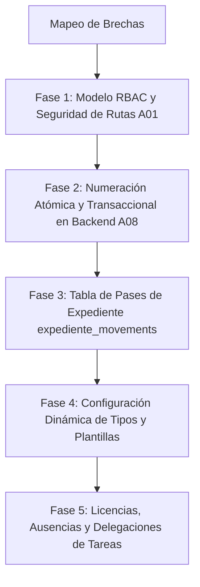

# 📊 Informe de Cumplimiento Técnico y Seguridad: Sistema GDE vs. SGDE.pdf

Este informe presenta un análisis detallado y riguroso del estado de cumplimiento del proyecto **Sistema GDE (Gestión Documental Electrónica)** en comparación con los requerimientos formales especificados en el documento **SGDE.pdf**.

El análisis abarca la arquitectura de software, la lógica del negocio distribuida entre el frontend y el backend, el diseño de la base de datos relacional y las directivas de seguridad crítica (OWASP Top 10 y buenas prácticas de desarrollo seguro).

---

## 🔍 Resumen Ejecutivo

El proyecto actual es un desarrollo Full Stack funcional con excelentes características modernas de rendimiento y seguridad criptográfica implementadas de forma nativa (2FA TOTP nativo, cifrado en reposo AES-256 de archivos adjuntos, firma digital de PDFs en background mediante BullMQ/Redis y verificación pública mediante QR).

Sin embargo, el sistema presenta **vacíos de diseño crítico** en su modelo de autorización, la gestión concurrente de la numeración legal y la parametrización dinámica del negocio. Actualmente, gran parte del control administrativo e integridad de los datos se confía al cliente (Frontend), lo que expone a la API a vulnerabilidades graves de **BOLA (Broken Object Level Authorization)** / **IDOR**.

---

## 🏛️ 1. Matriz de Cumplimiento por Módulos y Requerimientos

A continuación, se detalla el estado del proyecto con respecto a cada sección del pliego de requerimientos **SGDE.pdf**:

### 📊 1.1 Módulo de Autenticación, Acceso y Seguridad de API (Secciones 2.1, 10.1, 13)

| Requerimiento (PDF) | Estado en el Proyecto | Calificación | Hallazgo Técnico y Evidencia en Código |
| :--- | :--- | :--- | :--- |
| **Inicio de sesión** (Usuario/Contraseña) | **Implementado** | ✅ Conforme | Autenticación clásica en `authController.js:login` consultando la tabla `users` mediante hashing de contraseña con `bcrypt` (10 salt rounds base, 12 salt rounds en perfil). |
| **Inicio con CUIL/CUIT o Legajo** | **No Implementado** | ❌ Faltante | El esquema de la base de datos (`setup_full.js:16`) no cuenta con campos para CUIL, CUIT o Legajo. La autenticación está acotada estrictamente a `email`. |
| **Recuperación segura de contraseña** | **Implementado** | ✅ Conforme | Flujo robusto en `authController.js:forgotPassword`. Genera código aleatorio de 8 caracteres alfanuméricos (`reset_code`), define expiración a 15 min (`reset_expires`), compara de manera segura contra ataques de canal lateral utilizando `crypto.timingSafeEqual` e informa vía email. |
| **Cambio obligatorio en primer ingreso** | **No Implementado** | ❌ Faltante | No existe una bandera (ej: `first_login` o `force_reset`) en la tabla `users` ni lógica en `authController.js` para interceptar la sesión y exigir el cambio de clave. |
| **Bloqueo por intentos fallidos** | **No Implementado** | ❌ Faltante | Aunque se implementa un Rate Limiter genérico en la API (`middlewares/rateLimiter.js`), el sistema no rastrea intentos fallidos por usuario en la base de datos (faltan columnas como `login_attempts` y `lock_until`). |
| **Cierre automático por inactividad** | **No Implementado** | ❌ Faltante | El token JWT tiene una validez de 10 horas. Sin embargo, no hay un mecanismo en el frontend (`app.js`) que detecte inactividad corta del usuario (ej: 15 minutos de inactividad de mouse/teclado) para destruir el token localmente. |
| **Gestión y Cierre remoto de sesiones** | **Parcialmente** | ⚠️ A Mejorar | Se implementó una **blacklist en Redis** al hacer logout (`authController.js:472`). No obstante, al usar JWT "stateless", no existe un registro activo de sesiones en la BD (tabla `sessions`) que permita a un usuario ver y revocar inicios de sesión en otros dispositivos de forma remota. |
| **Soporte Multifactor (MFA/2FA)** | **Excelente** | ⭐ Sobresaliente | **Motor TOTP nativo** implementado en `authController.js` (RFC 6238) sin dependencias de terceros. Genera secretos Base32, códigos QR (`qrcode`), valida ventana de tiempo y administra 6 códigos de recuperación hasheados con `bcrypt` almacenados en formato JSON. Notifica por email SMTP la activación con detección de sistema operativo. |
| **Integración LDAP / Active Directory** | **Implementado** | ✅ Conforme | Servicio configurado en `services/ldapService.js` para validación de credenciales corporativas contra un servidor LDAP, coordinado en el flujo de Login principal. |
| **Rate Limiting y CORS** | **Implementado** | ✅ Conforme | Uso de `express-rate-limit` con almacenamiento en Redis para rutas de API y límites más estrictos en rutas públicas (como validación QR). Configuración de CORS segura en `server.js`. |

---

### 👥 1.2 Módulo de Usuarios (Sección 2.2)

| Requerimiento (PDF) | Estado en el Proyecto | Calificación | Hallazgo Técnico y Evidencia en Código |
| :--- | :--- | :--- | :--- |
| **Gestión de Usuarios (ABM)** | **Implementado** | ✅ Conforme | ABM administrativo completo en `userController.js` con métodos para crear, actualizar, eliminar e importar masivamente desde archivos CSV. |
| **Gestión Multi-Área** | **Excelente** | ⭐ Sobresaliente | La tabla `users` contiene una columna JSON `areas` (`userController.js:14`) que permite asociar un usuario a múltiples reparticiones. En el Frontend, el usuario puede alternar su área activa en tiempo real, lo que redibuja instantáneamente sus bandejas de entrada y borradores. |
| **Estado del Usuario** | **No Implementado** | ❌ Faltante | Falta una columna `status` (Enum: 'active', 'inactive', 'suspended') en la tabla `users`. El sistema asume que cualquier usuario presente en la BD está activo. |
| **Superior Jerárquico** | **No Implementado** | ❌ Faltante | No existe el campo `superior_id` en la tabla `users` para definir la cadena de mando. |
| **Licencias y Ausencias** | **No Implementado** | ❌ Faltante | No existe una estructura en la BD ni lógica en los controladores para registrar licencias médicas/vacacionales temporales de los agentes públicos. |
| **Delegación y Reemplazos** | **No Implementado** | ❌ Faltante | Falta por completo la lógica para asignar un reemplazo (`delegated_to`) que reciba la bandeja de tareas de un usuario ausente durante su periodo de licencia. |

---

### 🔑 1.3 Módulo de Roles y Permisos (Sección 2.3)

| Requerimiento (PDF) | Estado en el Proyecto | Calificación | Hallazgo Técnico y Evidencia en Código |
| :--- | :--- | :--- | :--- |
| **Modelo de permisos granular** (RBAC / ABAC) | **Insuficiente** | 🚨 **Crítico** | **No existe un modelo RBAC o ABAC en la base de datos**. Las tablas sugeridas (`roles`, `permissions`, `user_roles`) no están creadas. El sistema utiliza un esquema binario de rol duro (`role ENUM('admin', 'user') DEFAULT 'user'`) en la tabla `users`. |
| **Autorización obligatoria en API** | **Incumplido** | 🚨 **Crítico** | Las rutas en `routes/docRoutes.js` y `routes/expRoutes.js` solo exigen el middleware `authMiddleware`. **Cualquier usuario autenticado** puede modificar, descargar o leer fojas de cualquier expediente o documento llamando directamente a los endpoints `/api/docs/:id/content` o `/api/docs/update/:id`, ya que el backend no valida si el solicitante es el creador, dueño actual, pertenece al área autorizada o tiene el rol requerido. La seguridad se delega enteramente en el frontend ocultando botones en la interfaz web. |

---

### 📄 1.4 Gestión de Documentos (Sección 3)

| Requerimiento (PDF) | Estado en el Proyecto | Calificación | Hallazgo Técnico y Evidencia en Código |
| :--- | :--- | :--- | :--- |
| **Tipos Documentales Configurables** | **No Implementado** | ❌ Faltante | Los tipos de documentos (Memo, Nota, Acta, Resolucion) están listados como un array estático en el frontend (`app.js:242`). No existe una tabla `document_types` en la BD que permita parametrizar dinámicamente sus reglas de negocio (si requiere firma múltiple, si permite adjuntos, etc.). |
| **Editor Documental y Plantillas** | **Parcialmente** | ⚠️ A Mejorar | El editor está implementado en la UI (HTML enriquecido). Sin embargo, no existe un gestor de **plantillas** (`templates`) en la base de datos para precargar formatos predefinidos. |
| **Estados del Documento** (16 estados) | **Parcialmente** | ⚠️ A Mejorar | El sistema solo maneja 6 estados básicos: `Borrador`, `Firmándose`, `Firmado`, `Rechazado`, `Archivado` y `Anulado`. Faltan estados críticos del circuito administrativo como: *En revisión, Observado, En aprobación, Comunicado, Reservado, Vencido*. |
| **Numeración Automática Inmutable** | **Crítico** | 🚨 **Riesgo Grave** | **La numeración correlativa se genera en el cliente (Frontend)** a través de JavaScript usando contadores locales del estado de la SPA (`app.js:228: generateNumber`). Esto es sumamente peligroso e inseguro: si dos usuarios firman concurrentemente o refrescan la página, se producirán duplicaciones de números oficiales. No existe una tabla de secuencias (`numbering_sequences`) ni transaccionalidad atómica en el backend para reservar el número en la firma. |
| **Seguridad de Archivos Adjuntos** | **Excelente** | ⭐ Sobresaliente | Implementado con altos estándares de seguridad: *Multer* valida whitelist de tipos MIME y extensiones bloqueadas. Al subir un anexo, el backend genera un Vector de Inicialización (IV) único, **cifra el archivo en disco usando AES-256-CBC**, borra el temporal sin cifrar y sirve las descargas descifrando al vuelo vía Streams. |
| **Embeber adjuntos físicamente en el PDF** | **Excelente** | ⭐ Sobresaliente | Al momento del sellado final, `docController.js:embedAttachments` y `signatureWorker.js` leen los archivos adjuntos encriptados en el servidor, los descifran en memoria y los inyectan físicamente dentro del PDF principal como "Embedded Files" usando `pdf-lib` antes de la firma. |

---

### 📂 1.5 Expediente Electrónico (Sección 4)

| Requerimiento (PDF) | Estado en el Proyecto | Calificación | Hallazgo Técnico y Evidencia en Código |
| :--- | :--- | :--- | :--- |
| **Creación e Iniciación (Carátula)** | **Parcialmente** | ⚠️ A Mejorar | Se crean expedientes con asunto e iniciador. No obstante, no se genera un PDF oficial con la "Carátula de Inicio" foliada que identifique formalmente la pieza administrativa. |
| **Fojas y Vinculación de Documentos** | **Implementado** | ✅ Conforme | Se vinculan y desvinculan fojas de documentos firmados. La inmutabilidad de los expedientes archivados se logra mediante las fojas selladas (`sealed_docs`), almacenadas en formato JSON en MySQL. |
| **Pases Administrativos Formales** | **No Implementado** | ❌ Faltante | **No existe la tabla de Pases (`expediente_movements`)**. El pase de un área o usuario a otro se realiza modificando directamente la columna `current_owner_id` en la tabla principal `expedientes` a través del endpoint `/update/:id`. Al no registrar el pase transaccionalmente, se pierde por completo la trazabilidad de qué agente originó el pase, qué observaciones/notas de pase se añadieron y qué fojas se incorporaron exactamente en cada etapa del trámite. |
| **Exportación Completa de Expedientes** | **Excelente** | ⭐ Sobresaliente | El frontend genera un paquete comprimido `.zip` que contiene el archivo de texto inmutable de auditoría (`Historial_[Nro].txt`) y todos los PDFs correspondientes a las fojas numeradas. |
| **Fusión y Asociación** | **No Implementado** | ❌ Faltante | No existe lógica en el backend ni en la interfaz para relacionar expedientes entre sí o fusionar sus fojas. |

---

### 📥 1.6 Bandejas de Trabajo, Flujos e Historial (Secciones 5, 6, 8)

| Requerimiento (PDF) | Estado en el Proyecto | Calificación | Hallazgo Técnico y Evidencia en Código |
| :--- | :--- | :--- | :--- |
| **Bandejas Inteligentes** | **Parcialmente** | ⚠️ A Mejorar | Se implementan de forma reactiva las bandejas "Mis Trámites" (Bandeja Personal) y "Trámites de mi Área" en el Frontend. Faltan bandejas requeridas por el pliego como: *Bandeja de salida, Tareas vencidas y Tareas delegadas*. |
| **Motor de Reglas y Workflows** | **No Implementado** | ❌ Faltante | No hay un motor de workflows dinámicos. El flujo (ej: Redactor -> Firmante N -> Archivado) está codificado de forma estática en la interacción cliente-servidor. No existe la tabla `document_workflow` ni validaciones de transiciones lícitas de estados en el backend. |
| **Trazabilidad Absoluta (Auditoría)** | **Excelente** | ✅ Conforme | Implementado mediante la tabla física `history`. Cada acción crítica (Creación, Pase, Firma, Rechazo, Lectura) inserta un registro inmutable con fecha/hora real del servidor (forzada a Zona Horaria de Argentina). |
| **Búsqueda Avanzada e Indexación** | **Parcialmente** | ⚠️ A Mejorar | La búsqueda realiza filtros cruzados excelentes por campos principales en el frontend. En el backend, las consultas usan operadores `LIKE` básicos sobre MySQL. Faltan índices de texto completo (`FULLTEXT`) para búsquedas en cuerpos y contenidos de los PDFs. |

---

### ✍️ 1.7 Firma Electrónica y Digital (Sección 7)

| Requerimiento (PDF) | Estado en el Proyecto | Calificación | Hallazgo Técnico y Evidencia en Código |
| :--- | :--- | :--- | :--- |
| **Firma Digital con Certificado** | **Excelente** | ⭐ Sobresaliente | El backend implementa firma PKCS#7 nativa de PDF (`services/signatureService.js`) utilizando un certificado `.p12` global del servidor a través de la librería `node-signpdf`. |
| **Firma en Lote (Firma Masiva)** | **Excelente** | ⭐ Sobresaliente | **Diseño de alto rendimiento**. El usuario selecciona múltiples documentos en la vista `batch_sign` y el servidor **encola las tareas CPU-intensive en BullMQ (Redis)** (`signatureWorker.js`). Las firmas se procesan en segundo plano con una concurrencia limitada para no saturar el servidor, notificando el progreso. |
| **Firma Conjunta (Firma en Cascada)** | **Implementado** | ✅ Conforme | Soporte para múltiples firmantes. El documento circula en estado "Firmándose" y se estampa el PDF final únicamente cuando todos los firmantes declarados en el array JSON `signatories` aplican su firma. |
| **Inmutabilidad y QR de Validación** | **Excelente** | ⭐ Sobresaliente | Al finalizar la firma, se calcula el hash criptográfico SHA-256 del PDF y se estampa un código QR. El sistema expone una ruta pública (`docController.js:verifyPublicDoc`) que permite a cualquier ciudadano verificar el origen, firmantes y el hash del PDF para detectar alteraciones. |
| **Firma Digital Individual** (Tokens/Claves Propias) | **No Implementado** | ❌ Faltante | El sistema firma todos los PDFs con el certificado global del servidor. No tiene la capacidad de recibir certificados individuales de cada agente o interactuar con el estándar local de Firma Digital de cada usuario. |

---

## 🚨 2. Diagnóstico Crítico de Seguridad (Brechas e Incumplimientos)

Analizando el backend y el frontend con la rigurosidad del estándar **OWASP Top 10** y las buenas prácticas de seguridad exigidas por la regla global, se detectan los siguientes hallazgos críticos que deben ser subsanados prioritariamente antes de que el sistema opere en un entorno real:

### ⚠️ A01:2021-Broken Access Control (Control de Acceso Quebrado - Crítico)
* **Vulnerabilidad (IDOR / BOLA)**: Las rutas del backend para obtener el contenido del documento (`GET /api/docs/:id/content`), actualizar documentos (`PUT /api/docs/update/:id`) o actualizar expedientes (`PUT /api/exps/update/:id`) **carecen de validación de permisos de propiedad o de área**. Un usuario común autenticado, enviando peticiones directas a la API utilizando herramientas como `Postman` o `curl`, puede alterar los IDs de los parámetros para leer borradores confidenciales de otras personas, desvincular fojas de expedientes ajenos o modificar el contenido de documentos creados por otras áreas.
* **Solución Exigida**: Implementar un middleware de control de acceso a nivel de objeto (ACL/ABAC) en el backend que verifique:
  ```javascript
  // Ejemplo conceptual de validación requerida en backend
  if (document.creator_id !== req.user.id && !document.owners.includes(req.user.id) && !document.owners.includes(req.user.areaId)) {
      return res.status(403).json({ message: "Acceso denegado a este documento." });
  }
  ```

### ⚠️ A03:2021-Injection (Inyección SQL e Integridad - Medio)
* **Riesgo**: En el script de inicialización (`setup_full.js:43`), las contraseñas e inserciones iniciales se interpolan manualmente en los strings SQL (ej: `'${hash}'`). Aunque esto ocurre en el script de instalación inicial y no en la ejecución en caliente de la API, **se viola la regla de usar siempre consultas parametrizadas en todos los escenarios**. Todos los controladores de negocio sí hacen un uso correcto de las consultas parametrizadas, pero el estándar de código seguro debe ser del 100% en todo el repositorio.

### ⚠️ A08:2021-Software and Data Integrity Failures (Numeración e Integridad de Datos - Crítico)
* **Riesgo**: La generación del número legal de los documentos y expedientes se calcula en el Frontend de forma volátil (`app.js:generateNumber`).
  - Al no ser una operación transaccional de base de datos protegida con bloqueos atómicos, dos usuarios firmando al mismo tiempo pueden generar el mismo número de documento (ej: `NO-2026-000004-MUNI-DGADM`).
  - Esto viola las reglas administrativas de inmutabilidad y unicidad de la foliación pública.
* **Solución Exigida**: Crear una tabla física `numbering_sequences` en la base de datos y un controlador en el backend que, utilizando una transacción SQL (`SELECT ... FOR UPDATE`), incremente y reserve de forma segura y libre de colisiones el número oficial correlativo al momento exacto de la firma del documento.

---

## 📈 3. Plan de Mitigación y Propuesta de Refactorización (Roadmap)

Para llevar el proyecto actual al estado de cumplimiento del 100% con respecto al pliego **SGDE.pdf**, se propone la siguiente estrategia técnica dividida en etapas de prioridad:



### 🛠️ Fase 1: Implementación de Roles y Permisos (RBAC) y Seguridad en API (Prioridad 1)
1. **Esquema de BD**: Crear las tablas `roles`, `permissions` y `user_roles`.
2. **Roles Sugeridos**: Redactor, Revisor, Firmante, Mesa de Entrada, Admin Documental, Auditor y Administrador Técnico.
3. **Middlewares**: Crear un middleware `checkPermission(permissionName)` en el backend que intercepte los endpoints.
4. **Validación ACL**: Modificar los controladores de documentos y expedientes en el backend para que validen que el `req.user.id` o `req.user.areaId` coincide con el creador, destinatario o dueños antes de procesar cualquier lectura, adjunto o actualización.

### 🛠️ Fase 2: Robustecer la Numeración Oficial (Prioridad 2)
1. **Esquema de BD**: Crear la tabla `numbering_sequences` (id, doc_type, year, last_value).
2. **API**: Eliminar la función `generateNumber` del frontend. Crear un endpoint transaccional en el backend que asigne el número oficial correlativo libre de colisiones en el momento exacto en el que el documento entra a la firma final o en el que el expediente se caratula.

### 🛠️ Fase 3: Pases Formales de Expediente (Prioridad 3)
1. **Esquema de BD**: Crear la tabla `expediente_movements` (id, expediente_id, sender_id, sender_area_id, receiver_id, receiver_area_id, notes, created_at, linked_docs_snapshot).
2. **API**: Crear el endpoint `/api/exps/:id/pase` para mover expedientes de forma segura, dejando un log inmutable de pases administrativos con sus respectivas notas y fojas en esa instancia.

### 🛠️ Fase 4: Módulo de Licencias, Ausencias y Delegaciones (Prioridad 4)
1. **Esquema de BD**: Añadir campos `status` (Enum), `superior_id`, y una tabla `user_licences` (id, user_id, start_date, end_date, delegated_user_id) a la base de datos.
2. **Lógica de Bandeja**: Modificar el backend para que, si un usuario se encuentra en periodo de licencia activo, cualquier trámite o firma enrutada a su bandeja personal se desvíe automáticamente a la bandeja de su delegado asignado.

---

## 📋 Conclusión del Análisis

El proyecto actual cuenta con cimientos sumamente robustos y un desempeño tecnológico de alta calidad (cifrado en reposo, firmas criptográficas mediante workers en background, TOTP nativo y QR inmutable).

Sin embargo, para calificar como un **Sistema de Gestión Documental de grado institucional o corporativo**, es imperativo corregir la centralización de lógica de negocio en el cliente y blindar el backend mediante un modelo formal de roles y permisos (RBAC), control de accesos a nivel de objeto (ACL) y un sistema transaccional de numeración oficial libre de colisiones.
