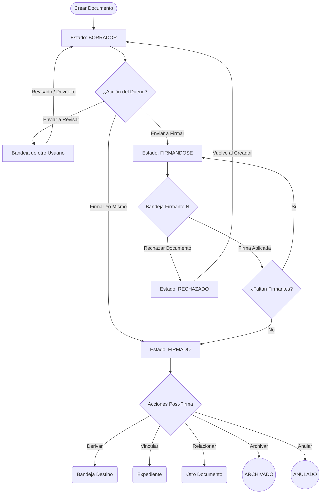
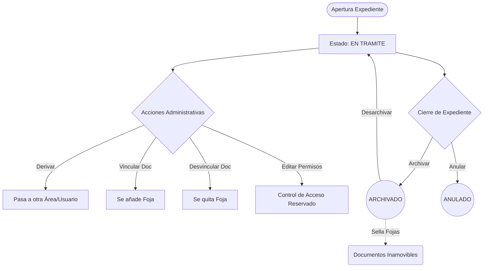
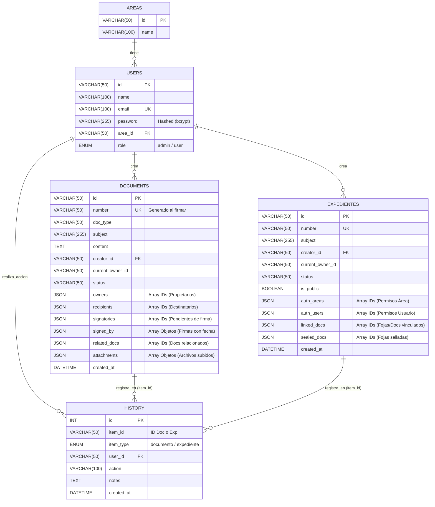

# Sistema GDE Web - Gestión Documental Electrónica 📄🏛️


GDE Web es un Sistema de Gestión Documental Electrónica Full Stack. Diseñado para simular el ecosistema de administración pública o corporativa, permite la creación, firma electrónica, enrutamiento, archivo y vinculación de Documentos y Expedientes con un estricto control de acceso y trazabilidad.

Esta aplicación separa claramente el Frontend (Vanilla JavaScript SPA) del Backend (API REST en Node.js/Express) respaldado por una base de datos relacional MySQL, garantizando seguridad, persistencia y escalabilidad.

## 📋 Tabla de Contenidos

- [Características Principales](#-características-principales)
- [Tipos de Documentos](#-tipos-de-documentos)
- [Ciclo de Vida y Diagramas de Flujo](#-ciclo-de-vida-y-diagramas-de-flujo)
  - [Flujo de Documentos](#1-ciclo-de-vida-de-un-documento)
  - [Flujo de Expedientes](#2-ciclo-de-vida-de-un-expediente)
  - [Diagrama Entidad-Relación (ERD)](#3-diagrama-entidad-relación-erd)
- [Estructura y Arquitectura Full Stack](#-estructura-y-arquitectura-full-stack)
- [Módulos del Sistema](#-módulos-del-sistema)
- [Instalación y Uso Local](#-instalación-y-uso-local)

---

## ✨ Características Principales

* **Arquitectura Cliente-Servidor:** Separación estricta entre Frontend (SPA) y Backend (API REST).
* **Base de Datos Relacional:** Uso de MySQL con aprovechamiento de columnas JSON para datos anidados (destinatarios, fojas, permisos).
* **Autenticación JWT:** Seguridad mediante JSON Web Tokens y contraseñas encriptadas con `bcrypt`.
* **Bandejas de Entrada Inteligentes:** Separación entre "Trámites Personales" y "Trámites de Área". Los documentos de Área son adquiridos por el primer usuario que los reclame, desapareciendo para el resto.
* **Firma Digital en Cascada:** Soporte para múltiples firmantes. El documento viaja y se estampa al completarse el circuito, indicando el Área Promotora.
* **Control Estricto de Enrutamiento:** Validaciones en Frontend y Backend para documentos que admiten destinatarios múltiples vs. destinatarios únicos.
* **Seguridad y Control de Acceso:** Expedientes configurables como "Públicos" o "Reservados" (con ACL por área o usuario).
* **Trazabilidad Absoluta (Auditoría):** Historial inmutable respaldado en BD para cada ítem, registrando actor, fecha, acción y destino.
* **Dashboard Estadístico:** Motor analítico interactivo con **Chart.js + DataLabels**. Gráficos dinámicos con filtros cruzados.
* **Exportación de Datos:** Descarga nativa de archivos `.csv` en todas las tablas y reportes estadísticos.

---

## 📑 Tipos de Documentos

El sistema clasifica los documentos por su comportamiento de enrutamiento:

1.  **Con Destinatario Único:** `Solicitud`, `Solicitud de Compra`, `Solicitud de Gasto`, `Orden de Compra`, `Carta`. (El sistema valida estrictamente que solo se envíen a 1 área o 1 usuario).
2.  **Con Destinatario Múltiple:** `Memo`, `Nota`, `Notificación`, `Circular`. (Pueden ir a múltiples áreas y usuarios simultáneamente).
3.  **Sin Destinatario (De Registro):** `Acta`, `Informe`, `Resolucion`, `Disposicion`, `Actuacion`, `Dictamen`, `Factura`, `Presupuesto`, `Contrato`, etc.

---

## 🔄 Ciclo de Vida y Diagramas de Flujo

### 1. Ciclo de Vida de un Documento
Desde el momento en que un usuario lo crea hasta que se estampa la firma y se archiva o vincula.


### 2. Ciclo de Vida de un Expediente
Los expedientes actúan como "carpetas contenedoras" (foliadas) que agrupan documentos firmados.

### 3. Diagrama Entidad-Relación (ERD)

El sistema utiliza un modelo de base de datos híbrido en MySQL. Combina el poder de las relaciones tradicionales (Claves Foráneas) para las entidades principales, con la flexibilidad de las **columnas JSON** para almacenar metadatos anidados (como arrays de fojas, archivos adjuntos, firmantes y destinatarios múltiples), evitando la sobrepoblación de tablas intermedias.



### 🏗️ Estructura y Arquitectura Full Stack
El proyecto implementa una arquitectura moderna cliente-servidor:

**Backend (Node.js + Express)**
Se encarga de la lógica de negocio profunda, seguridad y acceso a datos.

* `/config`: Configuración del Pool de conexiones a MySQL.
* `/controllers`: Manejadores de lógica (`authController`, `docController`, `expController`).
* `/middlewares`: Protección de rutas mediante verificación de JWT.
* `/routes`: Definición de Endpoints de la API REST.

**Frontend (Vanilla JS SPA)**
Se encarga exclusivamente de la presentación y la experiencia del usuario, consumiendo la API.

* `app.js`: Motor principal. Implementa un patrón de Estado Global Reactivo (`setState`) que repinta el DOM virtualmente. Centraliza las peticiones `fetch` hacia el Backend.

* UI/UX:

* **Tailwind CSS**: Clases estáticas para estilos rápidos y responsivos.
* **Lucide Icons**: Iconografía SVG limpia.
* **Sidebar Retráctil**: Menú lateral colapsable a modo "solo íconos" con tooltips.

### 🧩 Módulos del Sistema
**Seguridad y Autenticación:** Login real contra base de datos. Contraseñas hasheadas y generación de JWT.

**Mi Trabajo (Inbox & Drafts):**
* Bandejas divididas (Personal y de Área).
* Búsqueda en tiempo real cruzada.

**Creación de Trámites:**
* Formularios dinámicos.
* Buscadores integrados para filtrar el catálogo de documentos y seleccionar destinatarios.

**Archivo Central y Anulados:** Repositorios inmutables de consulta.

**Buscador Global:** Motor de búsqueda transversal respetando la ACL de cada usuario.

**Módulo de Estadísticas:**
* KPIs y ránkings Top 10 (Usuarios, Áreas, Documentos).
* Gráficos dinámicos interactivos.

**Administración:** ABM de Usuarios y Áreas (Solo rol `admin`).

### 🚀 Instalación y Uso Local
Prerrequisitos
* **Node.js** instalado.
* **MySQL** (o un entorno como XAMPP/WAMP) funcionando.
* Clonar este repositorio:
```bash
git clone https://github.com/sheyk87/Sistema_Documental_JS.git
```

**Paso 1: Configurar la Base de Datos (Backend)**
1- Navega a la carpeta del backend en tu terminal:
```bash
cd ruta/a/tu/backend
```

2- Instala las dependencias:
```bash
npm install
```

3- Crea un archivo `.env` en la raíz del backend con tus credenciales:
```bash
PORT=3000
DB_HOST=localhost
DB_USER=root
DB_PASSWORD=tu_password_mysql
DB_NAME=gde_system
JWT_SECRET=tu_secreto_seguro_123
```

4- Crea la base de datos gde_system en MySQL (puedes usar phpMyAdmin).
5- Ejecuta el script de inicialización para crear las tablas y los usuarios de prueba:
```bash
node setup_full.js
```

6- Enciende el servidor Backend:
```bash
npm run dev
```

**Paso 2: Ejecutar el Frontend**
* 1- Abre la carpeta del Frontend (donde están index.html y app.js) en Visual Studio Code.
* 2- Haz clic derecho sobre el archivo index.html y selecciona "Open with Live Server". (Requiere la extensión Live Server).
* 3- El navegador se abrirá mostrando el sistema.

**Credenciales de Prueba**
El script de inicialización crea los siguientes usuarios por defecto (todas las contraseñas son 123):

* **Admin:** `admin@gde.com` (Sistemas - Rol Admin)
* **User 1:** `juan@gde.com` (Dirección General)
* **User 2:** `maria@gde.com` (Recursos Humanos)

**Puntos a tener en cuenta para desplegar**
* **config/db.js:** Cambiar el límite de conexiones de la DB, línea `connectionLimit: 10`
* **Usar PM2 en el servidor:** En el servidor real, debes instalar PM2. Es un administrador que mantiene a Node.js vivo para siempre y lo reinicia automáticamente si se cae. Además, si le pasas el comando `pm2 start server.js -i max`, creará un "clon" de tu backend por cada núcleo de CPU que tenga tu servidor, duplicando su capacidad de respuesta.
* **Límite de tamaño de subida (Multer):** Debes ponerle un límite a multer en `routes/docRoutes.js`, línea `limits: { fileSize: 10 * 1024 * 1024 }`
* **Se pueden filtrar los tipos de archivos a subir:** Actualmente en el archivo `routes/docRoutes.js` se encuentra comentado el filtro de tipos de archivos permitidos para adjuntar.
