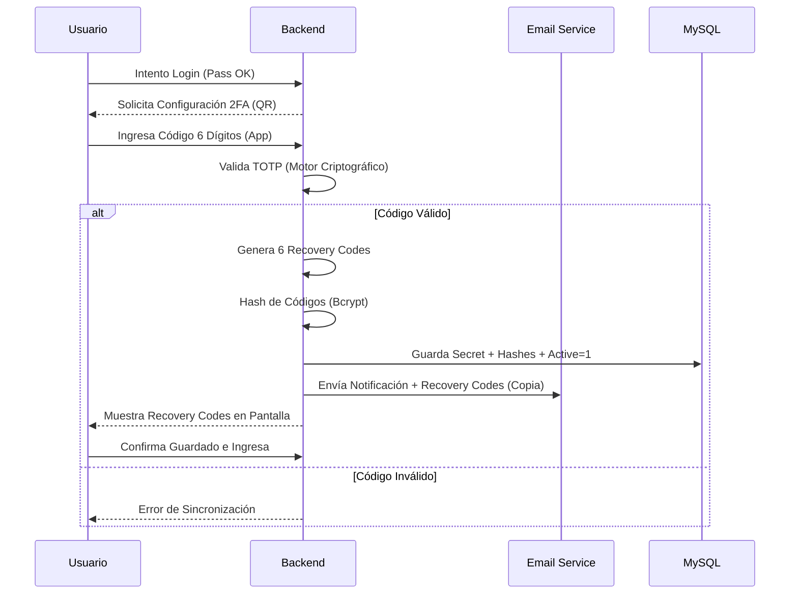
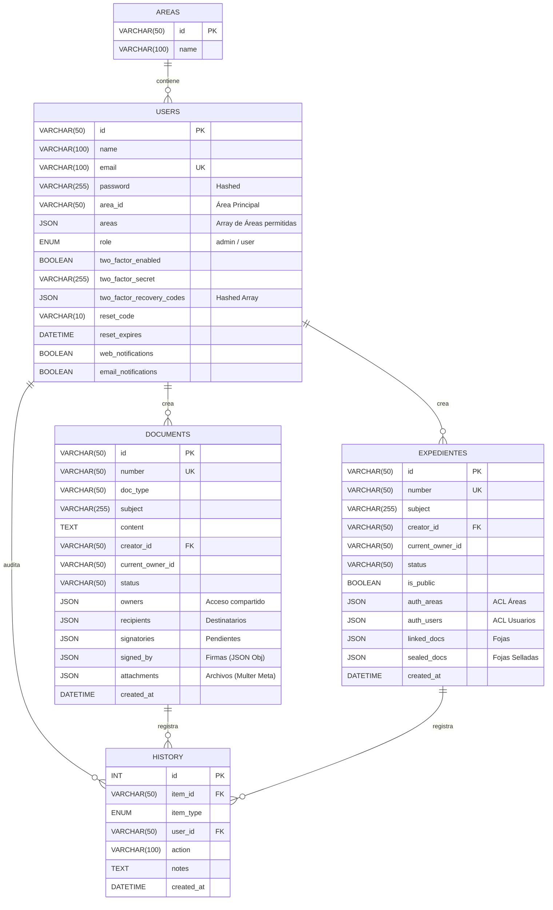

# Sistema GDE Web - Gestión Documental Electrónica 📄🏛️


GDE Web es un Sistema de Gestión Documental Electrónica Full Stack de grado institucional. Diseñado para simular el ecosistema de administración pública o corporativa, permite la creación, firma electrónica, enrutamiento, archivo y vinculación de Documentos y Expedientes con un estricto control de acceso y trazabilidad avanzada.

Esta aplicación separa claramente el Frontend (Vanilla JavaScript SPA) del Backend (API REST en Node.js/Express) respaldado por una base de datos relacional MySQL, garantizando seguridad criptográfica, persistencia y escalabilidad.

## 📋 Tabla de Contenidos

- [Características Principales](#-características-principales)
- [Seguridad de Grado Militar](#-seguridad-de-grado-militar)
- [Tipos de Documentos](#-tipos-de-documentos)
- [Ciclo de Vida y Diagramas de Flujo](#-ciclo-de-vida-y-diagramas-de-flujo)
  - [Flujo de Documentos](#1-ciclo-de-vida-de-un-documento)
  - [Flujo de Expedientes](#2-ciclo-de-vida-de-un-expediente)
  - [Proceso de Activación 2FA](#3-proceso-de-activación-2fa)
  - [Diagrama Entidad-Relación (ERD)](#4-diagrama-entidad-relación-erd)
- [Estructura y Arquitectura Full Stack](#-estructura-y-arquitectura-full-stack)
- [Módulos del Sistema](#-módulos-del-sistema)
- [Instalación y Uso Local](#-instalación-y-uso-local)

---

## ✨ Características Principales

* **Arquitectura Cliente-Servidor:** Separación estricta entre Frontend (SPA) y Backend (API REST).
* **Gestión Multi-Área:** Soporte para usuarios pertenecientes a múltiples reparticiones, con capacidad de alternar su área activa en tiempo real.
* **Bandejas de Entrada Inteligentes:** Separación entre "Trámites Personales" y "Trámites de Área". Los documentos de Área son adquiridos por el primer usuario que los reclame.
* **Firma Digital en Cascada:** Soporte para múltiples firmantes. El documento viaja y se estampa al completarse el circuito, indicando automáticamente el Área Promotora.
* **Trazabilidad Absoluta (Auditoría):** Historial inmutable para cada ítem, registrando actor, fecha, acción, notas y dispositivo de origen.
* **Dashboard Estadístico:** Motor analítico interactivo con **Chart.js + DataLabels**. Gráficos dinámicos con filtros cruzados por fecha, área y usuario.
* **Exportación de Datos:** Descarga nativa de archivos `.csv` en todas las tablas y reportes estadísticos. Exportación masiva de expedientes en formato `.zip` con PDFs y adjuntos.
* **Interfaz Adaptativa:** Soporte nativo para **Modo Oscuro** y diseño responsivo con Tailwind CSS.

---

## 🔒 Seguridad de Grado Militar

El sistema implementa capas de seguridad avanzadas para proteger la integridad documental:

* **Motor TOTP Nativo:** Implementación propia del algoritmo RFC 6238 (Google Authenticator) sin dependencias externas, garantizando compatibilidad total y sincronización de tiempo (Time Drift) de ±60s.
* **Códigos de Recuperación:** Generación de 6 códigos alfanuméricos de un solo uso, almacenados mediante hashing irreversible (`bcrypt`) en la base de datos.
* **Notificaciones Transaccionales:** Sistema de correo electrónico (SMTP) que informa cambios de contraseña, activaciones de seguridad, regeneración de códigos y auditoría administrativa con detección de dispositivo.
* **Confirmación de Doble Ciego:** Los administradores deben confirmar manualmente cualquier edición sobre perfiles de usuario antes de que el sistema dispare las notificaciones de auditoría.
* **Protección de Sesión:** JWT (JSON Web Tokens) con expiración controlada y cookies de sesión seguras.

---

## 📑 Tipos de Documentos

El sistema clasifica los documentos por su comportamiento de enrutamiento:

1.  **Con Destinatario Único:** `Solicitud`, `Solicitud de Compra`, `Carta`, etc. (Valida estrictamente 1 destino).
2.  **Con Destinatario Múltiple:** `Memo`, `Nota`, `Notificación`, `Circular`. (Enrutamiento paralelo a múltiples áreas).
3.  **Sin Destinatario (De Registro):** `Acta`, `Informe`, `Resolucion`, `Dictamen`, etc.

---

## 🔄 Ciclo de Vida y Diagramas de Flujo

### 1. Ciclo de Vida de un Documento

### 2. Ciclo de Vida de un Expediente
Los expedientes actúan como "carpetas contenedoras" (foliadas) que agrupan documentos firmados.

### 3. Proceso de Activación 2FA

El sistema garantiza que el usuario nunca pierda el acceso mediante una validación en dos pasos.



### 4. Diagrama Entidad-Relación (ERD)

El sistema utiliza un modelo de base de datos híbrido en MySQL. Combina el poder de las relaciones tradicionales (Claves Foráneas) para las entidades principales, con la flexibilidad de las **columnas JSON** para almacenar metadatos anidados (como arrays de fojas, archivos adjuntos, firmantes y destinatarios múltiples), evitando la sobrepoblación de tablas intermedias.



### 🏗️ Estructura y Arquitectura Full Stack
El proyecto implementa una arquitectura moderna cliente-servidor:

**Backend (Node.js + Express)**
Se encarga de la lógica de negocio profunda, seguridad y acceso a datos.

* `/config`: Pool de conexiones MySQL y constantes globales.
* `/controllers`: Lógica de negocio (`areaController`,`authController`, `docController`, `expController`, `notificationController`, `systemController`, `userController`).
* `/services`: Motores Core (Email Service SMTP, LDAP, Firma Digital).
* `/middlewares`: Verificación de integridad de JWT y Roles.
* `/routes`: Definición de Endpoints de la API REST.

**Frontend (Vanilla JS SPA)**
Se encarga exclusivamente de la presentación y la experiencia del usuario, consumiendo la API.

* `app.js`: Implementa un patrón de Estado Global Reactivo (`setState`). Cada cambio en el estado dispara un repintado virtual del DOM, asegurando una experiencia fluida de aplicación de una sola página sin frameworks pesados.

* UI/UX:

* **Tailwind CSS**: Clases estáticas para estilos rápidos y responsivos.
* **Lucide Icons**: Iconografía SVG limpia.
* **Sidebar Retráctil**: Menú lateral colapsable a modo "solo íconos" con tooltips.

### 🧩 Módulos del Sistema
**Seguridad y Autenticación:** Login real contra base de datos. Contraseñas hasheadas y generación de JWT.

**Mi Trabajo (Inbox & Drafts):**
* Bandejas divididas (Personal y de Área).
* Búsqueda en tiempo real cruzada.

**Creación de Trámites:**
* Formularios dinámicos.
* Buscadores integrados para filtrar el catálogo de documentos y seleccionar destinatarios.

**Archivo Central y Anulados:** Repositorios inmutables de consulta.

**Buscador Global:** Motor de búsqueda transversal respetando la ACL de cada usuario.

**Módulo de Estadísticas:**
* KPIs y ránkings Top 10 (Usuarios, Áreas, Documentos).
* Gráficos dinámicos interactivos.

**Administración: (Solo rol `admin`)** 
* ABM de Usuarios y Áreas.
* Configuración de Servicios: SMTP, LDAP, 2FA.

### 🚀 Instalación y Uso Local
Prerrequisitos
* **Node.js** instalado.
* **MySQL** (o un entorno como XAMPP/WAMP) funcionando.
* Clonar este repositorio:
```bash
git clone https://github.com/sheyk87/Sistema_Documental_JS.git
```

**Paso 1 (Backend): Configurar la Base de Datos y variables de entorno para Servicios**
1- Navega a la carpeta del backend en tu terminal:
```bash
cd ruta/a/tu/backend
```

2- Instala las dependencias:
```bash
npm install
```

3- Crea un archivo `.env` en la raíz del backend con tus credenciales:
```bash
PORT=3000
DB_HOST=localhost
DB_USER=root
DB_PASSWORD=R00tMySQL
DB_NAME=gde_system
JWT_SECRET=mi_palabra_secreta_super_segura_123
# Clave maestra de 32 bytes exactos para cifrado AES-256
FILE_SECRET=unaclavesupersecretaexactamented

# ==========================================
# CONFIGURACIÓN DE CORREO ELECTRÓNICO (SMTP)
# ==========================================

EMAIL_ENABLED=false
EMAIL_HOST=<servidor>
#<25 o 587 (Gmail)>
EMAIL_PORT=
# false para 587 (STARTTLS), false para 25, true solo para 465.
EMAIL_SECURE=false
EMAIL_USER=usuario@correo.com
EMAIL_PASS=<contraseña (De aplicación si es Gmail)>
EMAIL_FROM=Sistema GDE <usuario@correo.com>

# ==========================================
# CONFIGURACIÓN DE LDAP / ACTIVE DIRECTORY
# ==========================================
LDAP_ENABLED=false
LDAP_URL=ldap://192.168.1.200:389
# Si usas Active Directory, el dominio suele ser necesario para el Bind (ej: midominio.local)
LDAP_DOMAIN=midominio.local
TWO_FACTOR_GLOBAL_ENABLED=true
TWO_FACTOR_MANDATORY=false
```

4- Crea la base de datos `gde_system` en MySQL (puedes usar phpMyAdmin).

5- Ejecuta el script de inicialización para crear las tablas y los usuarios de prueba:
```bash
node setup_full.js
```

6- Crea el Certificado `certificado.p12` para firma digital de PDF:
```bash
openssl pkcs12 -export -out gde_backend/certs/certificado.p12 -inkey certificado.key -in certificado.crt -certfile CA.ca-bundle -name "Sello GDE"
```

7- Configura la `passphrase` en el archivo `gde_backend/services/signatureService.js`:

8- Enciende el servidor Backend:
```bash
npm run dev
```

**Paso 2: Ejecutar el Frontend**
* 1- Abre la carpeta del Frontend (donde están index.html y app.js) en Visual Studio Code.
* 2- Haz clic derecho sobre el archivo index.html y selecciona "Open with Live Server". (Requiere la extensión Live Server).
* 3- El navegador se abrirá mostrando el sistema.

**Credenciales de Prueba**
El script de inicialización crea los siguientes usuarios por defecto (todas las contraseñas son 123):

* **Admin:** `admin@gde.com` (Sistemas - Rol Admin)
* **User 1:** `juan@gde.com` (Dirección General)
* **User 2:** `maria@gde.com` (Recursos Humanos)

**Puntos a tener en cuenta para desplegar**
* **config/db.js:** Cambiar el límite de conexiones de la DB, línea `connectionLimit: 10`
* **Usar PM2 en el servidor:** En el servidor real, debes instalar PM2. Es un administrador que mantiene a Node.js vivo para siempre y lo reinicia automáticamente si se cae. Además, si le pasas el comando `pm2 start server.js -i max`, creará un "clon" de tu backend por cada núcleo de CPU que tenga tu servidor, duplicando su capacidad de respuesta.
* **Límite de tamaño de subida (Multer):** Debes ponerle un límite a multer en `routes/docRoutes.js`, línea `limits: { fileSize: 10 * 1024 * 1024 }`
* **Se pueden filtrar los tipos de archivos a subir:** Actualmente en el archivo `routes/docRoutes.js` se encuentra comentado el filtro de tipos de archivos permitidos para adjuntar.
