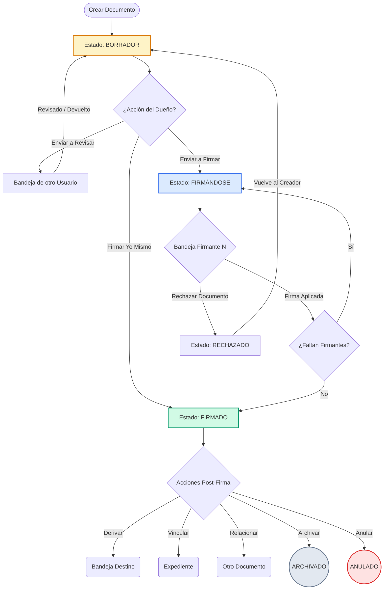
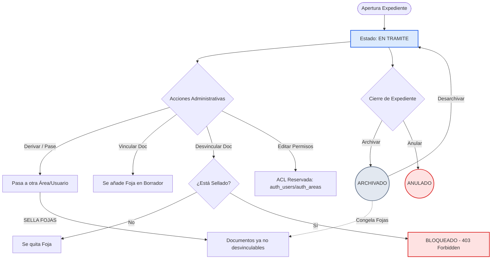
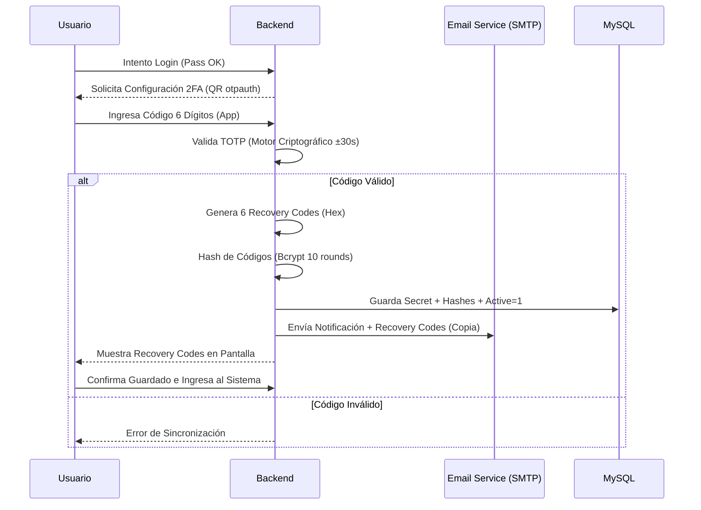
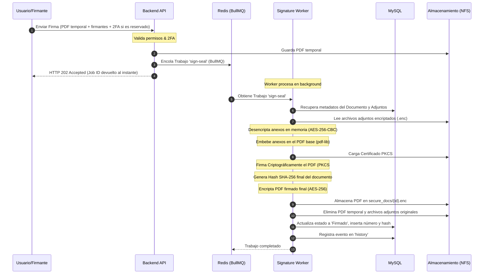
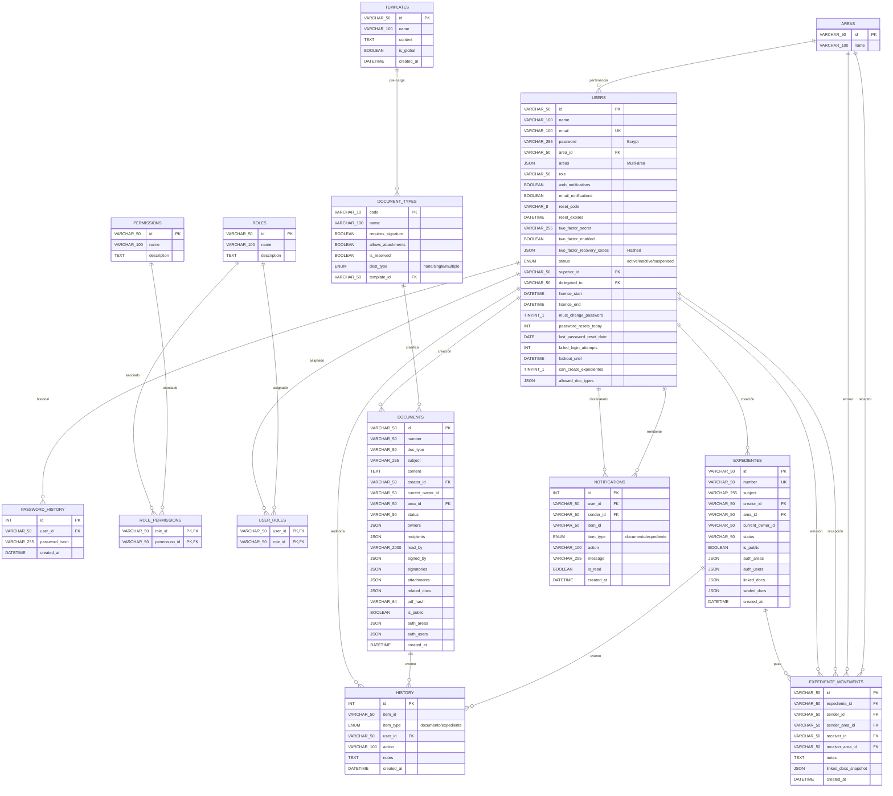
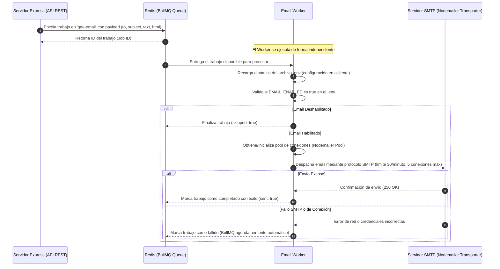

# Sistema GDE Web - Gestión Documental Electrónica 📄🏛️


GDE Web es un Sistema de Gestión Documental Electrónica (SGDE) Full Stack de grado institucional. Diseñado para simular con precisión el ecosistema administrativo del sector público o corporativo de alta seguridad, el sistema permite crear, firmar digitalmente, enrutar, archivar y vincular Documentos y Expedientes con auditorías inmutables, encriptación en reposo y control de acceso granular de nivel gubernamental (ACL).

La aplicación separa limpiamente el Frontend (SPA reactiva en Vanilla JavaScript) del Backend (API REST en Node.js/Express respaldada por MySQL, Redis y trabajadores de BullMQ), garantizando un rendimiento óptimo ante cargas pesadas y alta escalabilidad en clústeres.

---

## 📋 Tabla de Contenidos

- [✨ Características de Negocio](#-características-de-negocio)
- [🔒 Fortalezas y Directivas de Seguridad](#-fortalezas-y-directivas-de-seguridad)
- [🗄️ Estructura Completa de la Base de Datos](#%EF%B8%8F-estructura-completa-de-la-base-de-datos)
- [🔄 Ciclo de Vida y Diagramas de Flujo](#-ciclo-de-vida-y-diagramas-de-flujo)
  - [1. Ciclo de Vida de un Documento](#1-ciclo-de-vida-de-un-documento)
  - [2. Ciclo de Vida de un Expediente](#2-ciclo-de-vida-de-un-expediente)
  - [3. Proceso de Activación de 2FA](#3-proceso-de-activación-de-2fa)
  - [4. Flujo de Firma Digital en Cascada en Segundo Plano](#4-flujo-de-firma-digital-en-cascada-en-segundo-plano)
  - [5. Diagrama Entidad-Relación (ERD)](#5-diagrama-entidad-relación-erd)
  - [6. Diagrama de Tareas de Notificaciones por Email (Email Worker)](#6-diagrama-de-tareas-de-notificaciones-por-email-email-worker)
- [🏗️ Estructura y Arquitectura del Sistema](#%EF%B8%8F-estructura-y-arquitectura-del-sistema)
- [🚀 Instalación y Uso Local](#-instalación-y-uso-local)
- [🐳 Despliegue con Docker y Docker Swarm](#-despliegue-con-docker-y-docker-swarm)

---

## ✨ Características de Negocio

El sistema incorpora las siguientes funciones clave alineadas con flujos reales de tramitación:

### 👥 Modelo de Roles y Permisos Granulares (RBAC & ACL)
El sistema abandona el esquema plano de autorizaciones por un modelo híbrido basado en Roles y Permisos Granulares individuales mapeados a nivel de Endpoint y aplicados sobre cada objeto (ACL):
*   **Roles Estándar:**
    *   **Administrador Técnico (`admin`):** Gestión de usuarios, organigrama, credenciales SMTP/LDAP/2FA y auditoría.
    *   **Usuario Estándar (`user`):** Perfil operativo para confeccionar borradores, carátulas y pases de expedientes.
    *   **Redactor (`redactor`):** Preparación de borradores y transcripción de textos (sin potestad de firma o pase de expedientes).
    *   **Revisor (`revisor`):** Control formal y ortográfico de fojas asignadas antes de elevarlas a la firma.
    *   **Firmante Oficial (`firmante`):** Autoridades con token de firma digital y potestad legal.
    *   **Auditor Gubernamental (`auditor`):** Acceso global de **solo lectura** a documentos y expedientes (incluyendo reservados), y consulta de logs de auditoría forense.
*   **Seguridad por Objeto:** Se valida la tenencia física actual (`current_owner_id`) de manera estricta. El contenido de un documento o las fojas de un expediente se vuelven **inmutables** tras su firma, y las fojas vinculadas son **selladas definitivamente** al realizar un pase de expediente, imposibilitando su remoción posterior.

### 🏢 Gestión Multi-Área (Reparticiones Asignadas)
Los usuarios pueden pertenecer a múltiples áreas o dependencias del organigrama simultáneamente (almacenado en la columna JSON `areas`).
*   Tienen la capacidad de alternar su área activa en tiempo real.
*   Esto impacta dinámicamente en sus bandejas, permitiéndoles adquirir, reclamar u operar sobre los trámites asignados a cualquiera de las reparticiones a las que pertenecen.

### 📝 Plantillas Dinámicas de Documentos
El sistema soporta la creación de plantillas de redacción prediseñadas (globales o específicas) administradas en la tabla `templates`.
*   Cada tipo de documento (`document_types`) puede tener asignada una plantilla por defecto.
*   Al iniciar la confección de un borrador de ese tipo (ej. un Informe Técnico o una Disposición), el editor carga de forma predeterminada el formato base definido por la plantilla, estandarizando la imagen institucional.

### 👑 Superior Jerárquico
Cada usuario puede tener asignado un superior en el organigrama (`superior_id`).
*   El superior jerárquico tiene permisos implícitos de lectura, edición, firma y derivación para cualquier trámite o expediente que se encuentre actualmente en la bandeja (es decir, en tenencia física) de sus subordinados directos.
*   Esto evita cuellos de botella administrativos cuando un agente operativo no está disponible.

### 📅 Licencias / Ausencias y Delegación Automática
El sistema provee un mecanismo seguro para ausencias programadas (permanentes o temporales) autogestionado por el usuario o configurado por el Administrador:
*   **Desvío Automático:** Al activarse la licencia (`licence_start` y `licence_end`), toda nueva derivación dirigida al usuario en cuestión es redirigida inmediatamente al delegado designado (`delegated_to`).
*   **Prevención de Bucles Cruzados:** El sistema impide físicamente en base de datos la delegación circular (si A delegó en B, B no puede delegar en A).
*   **Notificaciones Transaccionales:** Al aplicarse el desvío, se notifica automáticamente a través de la campana del sistema y por correo electrónico (SMTP) al delegador e informando al delegado sobre su rol temporal, registrando la traza detallada en el historial de auditoría.

### ⚙️ Tipos de Documento Habilitados
La administración puede restringir individualmente los tipos de documentos que cada usuario puede generar (columna JSON `allowed_doc_types`). Asimismo, a través de la columna `can_create_expedientes`, se restringe la potestad del usuario para caratular o iniciar expedientes nuevos en el sistema.

### 🔒 Documentos y Expedientes Reservados (Privacidad y ACL)
El sistema soporta la creación de documentos y expedientes marcados como no públicos (`is_public = 0`).
*   **Reglas de Acceso Estrictas:** Solo pueden visualizarse por su creador, dueño actual, usuarios asignados explícitamente (`auth_users`) o pertenecientes a las áreas autorizadas (`auth_areas`). Los administradores y auditores gubernamentales también pueden visualizar este contenido.
*   **Tipos de Documento Reservados por Defecto:** Tipos sensibles (ej. Sanción o Acuerdos de Confidencialidad) se fuerzan de manera predeterminada a ser reservados en su creación.
*   **Firma con Segundo Factor (2FA):** Para autorizar y estampar la firma sobre un documento de carácter reservado, el firmante debe autenticar obligatoriamente la transacción ingresando su token 2FA en tiempo real, bloqueando la operación en caso de discrepancia.

### 🚦 Estado de la Cuenta
Cada cuenta de usuario posee un estado administrativo (`active`, `inactive`, `suspended`):
*   Los estados `inactive` y `suspended` impiden inmediatamente la autenticación en el sistema, cancelando la generación del token de sesión JWT y notificando al usuario de su condición.

### 🖋️ Funcionalidad de Firma y Rechazo Masivo
El sistema implementa una potente y segura característica para procesar múltiples documentos en un solo bloque:
*   **Firma Masiva Secuencial:** El usuario selecciona en su bandeja de "Firma Masiva" los documentos que desea firmar de forma conjunta.
    *   **Validación de 2FA Mandatoria:** Si la selección incluye algún documento de carácter *reservado*, el motor exige al firmante autenticar la transacción ingresando su token 2FA en tiempo real antes de iniciar la firma.
    *   **Procesamiento Cíclico Frontend:** El cliente web recorre secuencialmente los documentos seleccionados y aplica las firmas. Si es una firma intermedia, transfiere la pertenencia del trámite al siguiente firmante (`signatories[0]`).
    *   **Firma Final en Background (BullMQ):** En caso de ser la firma final, el cliente solicita un número oficial atómico en el backend y renderiza el PDF en memoria con `html2pdf()`. Este PDF crudo se sube mediante `/api/docs/sign-final/:id` a la cola asíncrona de BullMQ (`signatureQueue`), donde el *Signature Worker* se encarga de:
        1. Leer archivos adjuntos encriptados y descifrarlos en memoria.
        2. Embeber físicamente dichos adjuntos en el PDF (mediante `pdf-lib`).
        3. Firmar digitalmente el PDF final (criptografía PKCS#7 / certificado PKCS#12).
        4. Generar el hash SHA-256 definitivo y encriptar el archivo en reposo (`secure_docs/{id}.enc`).
        5. Actualizar el estado a `Firmado` e inyectar el número correlativo asignado.
    *   **Mecanismo de Rollback:** Ante cualquier fallo en la cadena de firma, el sistema deshace los cambios del documento afectado retornándolo al estado original exacto (rollback de estado, firmantes y número asignado) y continúa con el lote.
*   **Rechazo Masivo:** Permite devolver múltiples borradores elevados para firma. El usuario ingresa un único motivo general de rechazo y el sistema en bucle:
    *   Revierte el estado del documento a `Borrador` o `Rechazado`.
    *   Restablece como propietario actual (`current_owner_id`) y área (`area_id`) al redactor/remitente anterior.
    *   Registra el evento de rechazo masivo y su correspondiente motivo en el historial de auditoría (`history`).
    *   Notifica inmediatamente a los creadores de los documentos devueltos.

### 📥 Bandeja Principal de Usuario y Área (Tenencia Física y Reclamo)
La gestión operativa de los trámites se organiza en bandejas de entrada segmentadas por propiedad física para evitar la colisión de agentes públicos sobre un mismo expediente:
*   **Bandeja de Entrada Personal (Inbox):** Muestra los documentos y expedientes asignados directamente al usuario actual. Solo este usuario puede editarlos, derivarlos o firmarlos.
*   **Bandeja de Entrada del Área:** Muestra los trámites asignados al sector/departamento completo del usuario (basado en la pertenencia a múltiples áreas configurada en la columna JSON `areas`).
*   **Adquisición / Reclamo de Trámites:** Un agente puede "Adquirir" de forma explícita un trámite de la bandeja del área. Al hacerlo, el sistema actualiza de manera atómica el `current_owner_id` al ID del usuario y el trámite se traslada automáticamente a su bandeja personal (Inbox), bloqueándolo para otros agentes del área.

### 📝 Gestión de Borradores y Cifrado de Adjuntos
La fase inicial de redacción de los documentos se realiza de forma interactiva bajo estrictas directivas de confidencialidad:
*   **Mutabilidad de Borradores:** En el estado `BORRADOR` o `RECHAZADO`, el creador puede modificar libremente el asunto, cuerpo y destinatarios del documento.
*   **Cifrado en Reposo de Anexos (AES-256-CBC + IV Único):** Al adjuntar un archivo a un borrador, el backend cifra el binario utilizando el algoritmo AES-256-CBC con una clave de encriptación global y un vector de inicialización (IV) único generado de forma aleatoria por cada archivo. Este IV se incrusta como prefijo en el nombre físico del archivo guardado en el disco (`iv-nombre_original.enc`). Durante la descarga, el archivo se descifra "on the fly" y se transmite por streams de Express únicamente si el usuario solicitante supera las validaciones de acceso ACL.

### 📊 Dashboards Estadísticos y Exportación de Datos
El sistema ofrece a los administradores y auditores herramientas analíticas para monitorear el desempeño de la organización:
*   **Métricas de Rendimiento:** Un panel dinámico en el Frontend calcula totales de documentos por estado, firmantes con mayor volumen de firmas estampadas, expedientes en curso e historial general.
*   **Filtros Avanzados:** Segmentación por rango de fechas (desde/hasta), áreas específicas y usuarios.
*   **Exportación a CSV:** Genera archivos descargables estructurados con los listados de usuarios, áreas y métricas estadísticas agregadas.

### 📱 Interfaz Adaptativa (Responsiva) y Visualización en Modo Oscuro
La experiencia de usuario está optimizada para cualquier dispositivo y condición lumínica:
*   **Mobile-Cards:** La interfaz detecta dinámicamente si se accede desde un dispositivo móvil (`isMobile()` en la SPA) y reestructura las extensas tablas de datos en tarjetas compactas optimizadas para gestos táctiles, ocultando columnas redundantes.
*   **Modo Oscuro Integrado:** Implementado de forma nativa a nivel de CSS y Tailwind, el sistema permite alternar la visualización entre modo claro y oscuro, adaptando fondos, textos y componentes interactivos para reducir el cansancio visual.

### 🔔 Sistema de Notificaciones en Tiempo Real (Campana y Email)
Las notificaciones alertan de inmediato ante cualquier cambio de estado en el ecosistema documental:
*   **Notificaciones Internas (Campana):** Se almacenan en la tabla `notifications` y se actualizan dinámicamente en el menú superior de la aplicación.
*   **Notificaciones SMTP en Background:** Al enviarse un documento a firmar, bloquearse una cuenta por intentos fallidos, o redirigirse un trámite por licencia/ausencia, se genera un email. Para evitar latencia y bloqueos de red en el hilo de Express, el despacho de correos se encola en Redis y el *Email Worker* se encarga de enviarlo en segundo plano de manera controlada.

### 🔍 Validación por Código QR Público (Trazabilidad y Verificación)
Para garantizar la autenticidad y prevenir la alteración de documentos oficiales impresos o digitales, el sistema implementa una verificación descentralizada:
*   **Código QR Estampado:** Cada documento finalizado y firmado incluye un código QR dinámico apuntando a la dirección de verificación del sistema (`/?verify={id}`).
*   **Verificación sin Autenticación:** Cualquier usuario o tercero puede escanear el QR para acceder a la ruta pública del backend `/api/docs/verify-public/:id`.
*   **Privacidad Blindada (OWASP A01):** El endpoint público de validación retorna únicamente metadatos clave (estado, número oficial, tipo de documento, asunto, fecha de firma, nombre y área del firmante y hash digital SHA-256). **Bajo ninguna circunstancia se expone el cuerpo/contenido del documento o sus archivos adjuntos**, preservando la confidencialidad absoluta y cumpliendo con estándares de seguridad de datos de nivel institucional.

---

## 🔒 Fortalezas y Directivas de Seguridad

GDE Web fue diseñado con directrices de seguridad robustas de tipo industrial (OWASP Top 10):

### 🚫 Límites Operativos
*   **Restablecimiento de Contraseñas:** Se impone un límite de seguridad en base de datos de **máximo 5 reseteos de contraseña diarios** por usuario, mitigando ataques de denegación de servicio SMTP o phishing masivo.
*   **Límite de Carga de Archivos:** El tamaño máximo para adjuntos y anexos está limitado estrictamente en el backend (vía middleware de Multer) a **10 megabytes (10MB)**.

### 🔑 Política de Contraseñas y Credenciales
*   **Cifrado Irreversible:** Las contraseñas de los usuarios y administradores se encriptan utilizando el algoritmo de hashing `bcrypt` con un costo computacional elevado de **12 rondas de sal**.
*   **Prevención de Reutilización Histórica:** El sistema registra las contraseñas previas del usuario en la tabla `password_history`. En un restablecimiento, se verifica que la nueva clave no coincida con ninguna de las **últimas 10 contraseñas utilizadas**.
*   **Cambio de Contraseña Obligatorio:** Al ser creado un usuario por la administración o reestablecerse su cuenta, se le fuerza a cambiar su contraseña en el primer inicio de sesión mediante el flag `must_change_password`.

### ⌛ Expiración y Tiempos de Espera (Timeouts)
*   **Token Temporal de 2FA:** El token JWT emitido inmediatamente tras el ingreso exitoso de usuario y contraseña (pero antes de la verificación del OTP) expira de manera ineludible a los **5 minutos**.
*   **Expiración de Código de Reseteo:** Los códigos de restablecimiento de contraseña enviados por correo electrónico expiran transcurridos **15 minutos** de su generación.
*   **Duración de Sesión JWT:** Los tokens de autenticación activos generados tras superar todos los desafíos de seguridad (incluido 2FA si corresponde) poseen una vida útil máxima de **10 horas** (orientado al turno laboral extendido).

### 🔒 Bloqueos por Intentos Fallidos de Inicio de Sesión
*   **Bloqueo Temporal:** Si una cuenta registra **5 intentos fallidos consecutivos** de inicio de sesión, el sistema bloquea inmediatamente la cuenta por un periodo de **5 minutos** (estableciendo la columna `lockout_until` en base de datos).
*   **Alerta Temprana:** Al momento de ejecutarse el bloqueo, el sistema despacha de manera automatizada un correo SMTP informando al usuario sobre el bloqueo y el origen del incidente para detectar intrusiones sospechosas.

### 🛡️ Seguridad Criptográfica Avanzada
*   **Cifrado en Reposo de Archivos Adjuntos (AES-256-CBC):** Todos los anexos cargados a los borradores se cifran en el disco duro utilizando AES-256-CBC con una clave maestra (`FILE_SECRET`) y un vector de inicialización (IV) único generado de forma aleatoria por cada archivo. Dicho IV es embebido de forma segura como prefijo del nombre físico del archivo, permitiendo su desencriptado al vuelo en memoria únicamente si el usuario solicitante supera los controles ACL del documento.
*   **Cifrado en Reposo de PDFs Sellados:** Una vez que un documento es oficialmente firmado y finalizado, el PDF resultante se encripta mediante AES-256 en la carpeta segura `uploads/secure_docs/{id}.enc` previniendo la lectura directa de archivos en caso de brechas en el servidor físico.
*   **Comparación Timing-Safe:** Las validaciones de códigos de recuperación temporales se comparan en el backend mediante funciones resistentes a ataques de canal lateral de tiempo (`crypto.timingSafeEqual`).
*   **Mitigación de Revelación de Datos (OWASP A07):** Las respuestas de error durante login y restablecimiento de contraseña emplean mensajes genéricos e idénticos, evitando la enumeración o detección de existencia de correos electrónicos.
*   **Lista Negra de Tokens en Redis (JWT Blacklist):** Al realizar el cierre de sesión (logout), el token JWT es invalidado de forma real introduciéndolo en una base de datos Redis en memoria con un TTL equivalente al tiempo restante de vida del token, impidiendo ataques de secuestro o replay.
*   **Recarga Dinámica del Entorno (.env):** Para garantizar que cambios globales en políticas de seguridad (como SMTP, LDAP o 2FA obligatorio) tengan efecto inmediato sin interrumpir el servicio ni requerir un despliegue de contenedores, el backend relee y sobreescribe de forma dinámica las variables del archivo `.env` en cada inicio de sesión.
*   **Trazabilidad Forense Completa:** El sistema registra de forma inmutable en la tabla `history` cualquier transacción o acción realizada sobre documentos y expedientes (creación, edición, firma, pase, derivación, archivo, desarchivo y anulación) indexando la fecha, la acción y el usuario responsable, impidiendo cualquier alteración posterior de la traza de auditoría.

---

## 🗄️ Estructura Completa de la Base de Datos

El motor relacional MySQL organiza la información a través de las siguientes tablas optimizadas con índices de alto rendimiento:

```
                                  +-------------------+
                                  |       areas       |
                                  +-------------------+
                                  | PK  id            |
                                  |     name          |
                                  +-------------------+
                                            |
                                            | 1
                                            |
                                            | 1..*
                                  +-------------------+
                                  |       users       |
                                  +-------------------+
             +--------------------> PK  id            | <-----------------------+
             |                    | FK  area_id       |                         |
             |                    |     name, email   |                         |
             |                    |     password      |                         |
             |                    |     areas (JSON)  |                         |
             |                    |     ...           |                         |
             |                    +-------------------+                         |
             |                              |                                   |
             |                              | 1                                 |
             |                              |                                   |
             |                              | 0..*                              |
+--------------------------+      +-------------------+      +--------------------------+
|     password_history     |      |    user_roles     |      |      notifications       |
+--------------------------+      +-------------------+      +--------------------------+
| PK  id                   |      | PK,FK user_id     |      | PK  id                   |
| FK  user_id              |      | PK,FK role_id     |      | FK  user_id              |
|     password_hash        |      +-------------------+      | FK  sender_id            |
|     created_at           |                |                |     item_id, item_type   |
+--------------------------+                | *              |     message, is_read     |
                                            |                |     created_at           |
                                            | 1              +--------------------------+
                                  +-------------------+
                                  |       roles       |
                                  +-------------------+
                                  | PK  id            |
                                  |     name, desc    |
                                  +-------------------+
                                            | 1
                                            |
                                            | 1..*
                                  +-------------------+
                                  | role_permissions  |
                                  +-------------------+
                                  | PK,FK role_id     |
                                  | PK,FK perm_id     |
                                  +-------------------+
                                            | 1..*
                                            |
                                            | 1
                                  +-------------------+
                                  |    permissions    |
                                  +-------------------+
                                  | PK  id            |
                                  |     name, desc    |
                                  +-------------------+
```

### 1. `areas`
Almacena las diferentes reparticiones y sectores de la organización.
*   `id` VARCHAR(50) [PRIMARY KEY]
*   `name` VARCHAR(100) [NOT NULL]

### 2. `users`
Contiene la ficha maestra de agentes públicos, sus estados y directivas de seguridad.
*   `id` VARCHAR(50) [PRIMARY KEY]
*   `name` VARCHAR(100) [NOT NULL]
*   `email` VARCHAR(100) [NOT NULL, UNIQUE]
*   `password` VARCHAR(255) [NOT NULL]
*   `area_id` VARCHAR(50) [NOT NULL, FOREIGN KEY -> `areas.id`]
*   `areas` JSON [Array de Áreas adicionales para gestión multi-área]
*   `role` VARCHAR(50) [DEFAULT 'user']
*   `web_notifications` BOOLEAN [DEFAULT TRUE]
*   `email_notifications` BOOLEAN [DEFAULT TRUE]
*   `reset_code` VARCHAR(8) [DEFAULT NULL]
*   `reset_expires` DATETIME [DEFAULT NULL]
*   `two_factor_secret` VARCHAR(255) [DEFAULT NULL]
*   `two_factor_enabled` BOOLEAN [DEFAULT FALSE]
*   `two_factor_recovery_codes` JSON [Códigos hasheados con bcrypt]
*   `status` ENUM('active', 'inactive', 'suspended') [DEFAULT 'active']
*   `superior_id` VARCHAR(50) [DEFAULT NULL, FOREIGN KEY -> `users.id`]
*   `delegated_to` VARCHAR(50) [DEFAULT NULL, FOREIGN KEY -> `users.id`]
*   `licence_start` DATETIME [DEFAULT NULL]
*   `licence_end` DATETIME [DEFAULT NULL]
*   `must_change_password` TINYINT(1) [DEFAULT 1]
*   `password_resets_today` INT [DEFAULT 0]
*   `last_password_reset_date` DATE [DEFAULT NULL]
*   `failed_login_attempts` INT [DEFAULT 0]
*   `lockout_until` DATETIME [DEFAULT NULL]
*   `can_create_expedientes` TINYINT(1) [DEFAULT 1]
*   `allowed_doc_types` JSON [DEFAULT NULL]
*   *Índices de Rendimiento:* `idx_users_area` sobre `area_id`.

### 3. `password_history`
Historial de contraseñas de usuario para impedir la reutilización de las últimas 10 contraseñas.
*   `id` INT [PRIMARY KEY, AUTO_INCREMENT]
*   `user_id` VARCHAR(50) [NOT NULL, FOREIGN KEY -> `users.id` ON DELETE CASCADE]
*   `password_hash` VARCHAR(255) [NOT NULL]
*   `created_at` DATETIME [DEFAULT CURRENT_TIMESTAMP]

### 4. `roles`
Lista de roles del sistema con descripciones explícitas para tooltips flotantes en la interfaz de administración.
*   `id` VARCHAR(50) [PRIMARY KEY]
*   `name` VARCHAR(100) [NOT NULL, UNIQUE]
*   `description` TEXT [NULL]

### 5. `permissions`
Catálogo de permisos granulares del sistema.
*   `id` VARCHAR(50) [PRIMARY KEY]
*   `name` VARCHAR(100) [NOT NULL, UNIQUE]
*   `description` TEXT [NULL]

### 6. `role_permissions`
Relación muchos-a-muchos entre roles y permisos.
*   `role_id` VARCHAR(50) [PRIMARY KEY, FOREIGN KEY -> `roles.id` ON DELETE CASCADE]
*   `permission_id` VARCHAR(50) [PRIMARY KEY, FOREIGN KEY -> `permissions.id` ON DELETE CASCADE]

### 7. `user_roles`
Relación muchos-a-muchos entre usuarios y sus múltiples roles asignados.
*   `user_id` VARCHAR(50) [PRIMARY KEY, FOREIGN KEY -> `users.id` ON DELETE CASCADE]
*   `role_id` VARCHAR(50) [PRIMARY KEY, FOREIGN KEY -> `roles.id` ON DELETE CASCADE]

### 8. `templates`
Plantillas dinámicas para la pre-carga en borradores.
*   `id` VARCHAR(50) [PRIMARY KEY]
*   `name` VARCHAR(100) [NOT NULL]
*   `content` TEXT [NOT NULL]
*   `is_global` BOOLEAN [DEFAULT FALSE]
*   `created_at` DATETIME [DEFAULT CURRENT_TIMESTAMP]

### 9. `document_types`
Catálogo de tipos documentales válidos, parametrización de privacidad y su plantilla base.
*   `code` VARCHAR(10) [PRIMARY KEY]
*   `name` VARCHAR(100) [NOT NULL, UNIQUE]
*   `requires_signature` BOOLEAN [DEFAULT TRUE]
*   `allows_attachments` BOOLEAN [DEFAULT TRUE]
*   `is_reserved` BOOLEAN [DEFAULT FALSE]
*   `dest_type` ENUM('none', 'single', 'multiple') [DEFAULT 'none']
*   `template_id` VARCHAR(50) [NULL, FOREIGN KEY -> `templates.id` ON DELETE SET NULL]

### 10. `documents`
Repositorio principal de documentos institucionales públicos y reservados.
*   `id` VARCHAR(50) [PRIMARY KEY]
*   `number` VARCHAR(50) [DEFAULT NULL]
*   `doc_type` VARCHAR(50) [NOT NULL]
*   `subject` VARCHAR(255) [NOT NULL]
*   `content` TEXT [NOT NULL]
*   `creator_id` VARCHAR(50) [NOT NULL, FOREIGN KEY -> `users.id`]
*   `current_owner_id` VARCHAR(50) [NOT NULL]
*   `area_id` VARCHAR(50) [DEFAULT NULL, FOREIGN KEY -> `areas.id`]
*   `status` VARCHAR(50) [NOT NULL]
*   `owners` JSON [Accesos compartidos]
*   `recipients` JSON [Destinatarios asignados]
*   `read_by` VARCHAR(2000) [DEFAULT '[]']
*   `signed_by` JSON [Firmas estampadas]
*   `signatories` JSON [Firmantes pendientes]
*   `attachments` JSON [Metadatos de archivos adjuntos]
*   `related_docs` JSON [Documentos vinculados]
*   `pdf_hash` VARCHAR(64) [DEFAULT NULL]
*   `is_public` BOOLEAN [DEFAULT TRUE]
*   `auth_areas` JSON [ACL Áreas autorizadas para reservados]
*   `auth_users` JSON [ACL Usuarios autorizados para reservados]
*   `created_at` DATETIME [DEFAULT CURRENT_TIMESTAMP]
*   *Índices de Rendimiento:*
    *   `idx_docs_status` sobre `status`
    *   `idx_docs_creator` sobre `creator_id`
    *   `idx_docs_owner` sobre `current_owner_id`
    *   `idx_docs_area` sobre `area_id`
    *   `idx_docs_created` sobre `created_at`

### 11. `expedientes`
Carpetas electrónicas contenedoras de fojas documentales vinculadas.
*   `id` VARCHAR(50) [PRIMARY KEY]
*   `number` VARCHAR(50) [UNIQUE, NOT NULL]
*   `subject` VARCHAR(255) [NOT NULL]
*   `creator_id` VARCHAR(50) [NOT NULL, FOREIGN KEY -> `users.id`]
*   `area_id` VARCHAR(50) [DEFAULT NULL, FOREIGN KEY -> `areas.id`]
*   `current_owner_id` VARCHAR(50) [NOT NULL]
*   `status` VARCHAR(50) [NOT NULL]
*   `is_public` BOOLEAN [DEFAULT TRUE]
*   `auth_areas` JSON [ACL Áreas autorizadas para expedientes reservados]
*   `auth_users` JSON [ACL Usuarios autorizados para expedientes reservados]
*   `linked_docs` JSON [Listado total de fojas vinculadas]
*   `sealed_docs` JSON [Fojas inamovibles tras pases]
*   `created_at` DATETIME [DEFAULT CURRENT_TIMESTAMP]
*   *Índices de Rendimiento:*
    *   `idx_exp_status` sobre `status`
    *   `idx_exp_owner` sobre `current_owner_id`
    *   `idx_exp_creator` sobre `creator_id`

### 12. `expediente_movements`
Registro inmutable de los pases físicos (derivaciones) de los expedientes.
*   `id` VARCHAR(50) [PRIMARY KEY]
*   `expediente_id` VARCHAR(50) [NOT NULL, FOREIGN KEY -> `expedientes.id` ON DELETE CASCADE]
*   `sender_id` VARCHAR(50) [NOT NULL, FOREIGN KEY -> `users.id`]
*   `sender_area_id` VARCHAR(50) [NOT NULL, FOREIGN KEY -> `areas.id`]
*   `receiver_id` VARCHAR(50) [DEFAULT NULL, FOREIGN KEY -> `users.id`]
*   `receiver_area_id` VARCHAR(50) [NOT NULL, FOREIGN KEY -> `areas.id`]
*   `notes` TEXT
*   `linked_docs_snapshot` JSON [Captura del estado de fojas en el momento exacto del pase]
*   `created_at` DATETIME [DEFAULT CURRENT_TIMESTAMP]

### 13. `numbering_sequences`
Garantiza la asignación atómica y correlativa de números oficiales por tipo y año.
*   `id` INT [PRIMARY KEY, AUTO_INCREMENT]
*   `doc_type` VARCHAR(50) [NOT NULL]
*   `year` INT [NOT NULL]
*   `last_value` INT [NOT NULL, DEFAULT 0]
*   *Restricción:* `uq_type_year` UNIQUE KEY (`doc_type`, `year`).

### 14. `history`
Registro inmutable para trazas de auditoría de todas las acciones en documentos y expedientes.
*   `id` INT [PRIMARY KEY, AUTO_INCREMENT]
*   `item_id` VARCHAR(50) [NOT NULL]
*   `item_type` ENUM('documento', 'expediente') [NOT NULL]
*   `user_id` VARCHAR(50) [NOT NULL, FOREIGN KEY -> `users.id`]
*   `action` VARCHAR(100) [NOT NULL]
*   `notes` TEXT
*   `created_at` DATETIME [DEFAULT CURRENT_TIMESTAMP]
*   *Índices de Rendimiento:*
    *   `idx_history_item` sobre `(item_id, item_type)`
    *   `idx_history_created` sobre `created_at`
    *   `idx_history_action_type_created` sobre `(item_type, action, created_at)`
    *   `idx_history_user` sobre `user_id`

### 15. `notifications`
Campana de notificaciones de la aplicación en tiempo real.
*   `id` INT [PRIMARY KEY, AUTO_INCREMENT]
*   `user_id` VARCHAR(50) [NOT NULL, FOREIGN KEY -> `users.id`]
*   `sender_id` VARCHAR(50) [NOT NULL, FOREIGN KEY -> `users.id`]
*   `item_id` VARCHAR(50) [NOT NULL]
*   `item_type` ENUM('documento', 'expediente') [NOT NULL]
*   `action` VARCHAR(100) [NOT NULL]
*   `message` VARCHAR(255) [NOT NULL]
*   `is_read` BOOLEAN [DEFAULT FALSE]
*   `created_at` DATETIME [DEFAULT CURRENT_TIMESTAMP]
*   *Índices de Rendimiento:*
    *   `idx_notif_user_read` sobre `(user_id, is_read)`
    *   `idx_notif_created` sobre `created_at`

---

## 🔄 Ciclo de Vida y Diagramas de Flujo

### 1. Ciclo de Vida de un Documento
Representa la transición de estados de una pieza documental desde su redacción inicial hasta su archivo definitivo o su anulación legal:


```mermaid
graph TD
    A([Crear Documento]) --> B[Estado: BORRADOR]
    B --> C{¿Acción del Dueño?}
    
    C -->|Enviar a Revisar| D[Bandeja de otro Usuario]
    D -->|Revisado / Devuelto| B
    
    C -->|Firmar Yo Mismo| E[Estado: FIRMADO]
    
    C -->|Enviar a Firmar| F[Estado: FIRMÁNDOSE]
    F --> G{Bandeja Firmante N}
    G -->|Firma Aplicada| H{¿Faltan Firmantes?}
    H -->|Sí| F
    H -->|No| E
    G -->|Rechazar Documento| I[Estado: RECHAZADO]
    I -->|Vuelve al Creador| B
    
    E --> J{Acciones Post-Firma}
    J -->|Derivar| K(Bandeja Destino)
    J -->|Vincular| L(Expediente)
    J -->|Relacionar| M(Otro Documento)
    J -->|Archivar| N((ARCHIVADO))
    J -->|Anular| O((ANULADO))
    
    style B fill:#fef3c7,stroke:#d97706,stroke-width:2px
    style F fill:#dbeafe,stroke:#2563eb,stroke-width:2px
    style E fill:#d1fae5,stroke:#059669,stroke-width:2px
    style N fill:#e2e8f0,stroke:#64748b,stroke-width:2px
    style O fill:#fee2e2,stroke:#dc2626,stroke-width:2px
```

### 2. Ciclo de Vida de un Expediente
Los expedientes operan bajo directivas inmutables de foliación para salvaguardar la integridad de los trámites:


```mermaid
graph TD
    A([Apertura Expediente]) --> B[Estado: EN TRAMITE]
    
    B --> C{Acciones Administrativas}
    C -->|Derivar / Pase| D[Pasa a otra Área/Usuario]
    D -->|SELLA FOJAS| E[Documentos ya no desvinculables]
    C -->|Vincular Doc| F[Se añade Foja en Borrador]
    C -->|Desvincular Doc| G{¿Está Sellado?}
    G -->|No| H[Se quita Foja]
    G -->|Sí| I[BLOQUEADO - 403 Forbidden]
    C -->|Editar Permisos| J[ACL Reservada: auth_users/auth_areas]
    
    B --> K{Cierre de Expediente}
    K -->|Archivar| L((ARCHIVADO))
    L -.->|Congela Fojas| E
    L -->|Desarchivar| B
    
    K -->|Anular| M((ANULADO))
    
    style B fill:#dbeafe,stroke:#2563eb,stroke-width:2px
    style I fill:#fee2e2,stroke:#dc2626,stroke-width:2px
    style L fill:#e2e8f0,stroke:#64748b,stroke-width:2px
    style M fill:#fee2e2,stroke:#dc2626,stroke-width:2px
```

### 3. Proceso de Activación de 2FA
Diagrama de secuencia que ilustra el proceso criptográfico de doble ciego nativo y la generación inicial de códigos de recuperación de un solo uso:


```mermaid
sequenceDiagram
    participant U as Usuario
    participant B as Backend
    participant E as Email Service (SMTP)
    participant DB as MySQL

    U->>B: Intento Login (Pass OK)
    B-->>U: Solicita Configuración 2FA (QR otpauth)
    U->>B: Ingresa Código 6 Dígitos (App)
    B->>B: Valida TOTP (Motor Criptográfico ±30s)
    alt Código Válido
        B->>B: Genera 6 Recovery Codes (Hex)
        B->>B: Hash de Códigos (Bcrypt 10 rounds)
        B->>DB: Guarda Secret + Hashes + Active=1
        B->>E: Envía Notificación + Recovery Codes (Copia)
        B-->>U: Muestra Recovery Codes en Pantalla
        U->>B: Confirma Guardado e Ingresa al Sistema
    else Código Inválido
        B-->>U: Error de Sincronización
    end
```

### 4. Flujo de Firma Digital en Cascada en Segundo Plano
Para evitar la degradación del rendimiento por operaciones de uso intensivo de CPU durante la manipulación de PDFs, el sistema delega la firma digital y el sellado de anexos a colas de BullMQ procesadas en background:


```mermaid
sequenceDiagram
    autonumber
    participant U as Usuario/Firmante
    participant B as Backend API
    participant R as Redis (BullMQ)
    participant W as Signature Worker
    participant DB as MySQL
    participant FS as Almacenamiento (NFS)

    U->>B: Enviar Firma (PDF temporal + firmantes + 2FA si es reservado)
    Note over B: Valida permisos & 2FA
    B->>FS: Guarda PDF temporal
    B->>R: Encola Trabajo 'sign-seal' (BullMQ)
    B-->>U: HTTP 202 Accepted (Job ID devuelto al instante)
    
    Note over W: Worker procesa en background
    R->>W: Obtiene Trabajo 'sign-seal'
    W->>DB: Recupera metadatos del Documento y Adjuntos
    W->>FS: Lee archivos adjuntos encriptados (.enc)
    Note over W: Desencripta anexos en memoria (AES-256-CBC)
    Note over W: Embebe anexos en el PDF base (pdf-lib)
    W->>FS: Carga Certificado PKCS#12 (certificado.p12)
    Note over W: Firma Criptográficamente el PDF (PKCS#7 node-signpdf)
    Note over W: Genera Hash SHA-256 final del documento
    Note over W: Encripta PDF firmado final (AES-256)
    W->>FS: Almacena PDF en secure_docs/{id}.enc
    W->>FS: Elimina PDF temporal y archivos adjuntos originales
    W->>DB: Actualiza estado a 'Firmado', inserta número y hash
    W->>DB: Registra evento en 'history'
    W-->>R: Trabajo completado
```

### 5. Diagrama Entidad-Relación (ERD)
La base de datos relacional MySQL combina la integridad referencial fuerte con la flexibilidad del almacenamiento estructurado mediante columnas JSON:


```mermaid
erDiagram
    AREAS {
        VARCHAR_50 id PK
        VARCHAR_100 name
    }
    
    USERS {
        VARCHAR_50 id PK
        VARCHAR_100 name
        VARCHAR_100 email UK
        VARCHAR_255 password "Bcrypt"
        VARCHAR_50 area_id FK
        JSON areas "Multi-área"
        VARCHAR_50 role
        BOOLEAN web_notifications
        BOOLEAN email_notifications
        VARCHAR_8 reset_code
        DATETIME reset_expires
        VARCHAR_255 two_factor_secret
        BOOLEAN two_factor_enabled
        JSON two_factor_recovery_codes "Hashed"
        ENUM status "active/inactive/suspended"
        VARCHAR_50 superior_id FK
        VARCHAR_50 delegated_to FK
        DATETIME licence_start
        DATETIME licence_end
        TINYINT_1 must_change_password
        INT password_resets_today
        DATE last_password_reset_date
        INT failed_login_attempts
        DATETIME lockout_until
        TINYINT_1 can_create_expedientes
        JSON allowed_doc_types
    }
    
    PASSWORD_HISTORY {
        INT id PK
        VARCHAR_50 user_id FK
        VARCHAR_255 password_hash
        DATETIME created_at
    }
    
    ROLES {
        VARCHAR_50 id PK
        VARCHAR_100 name
        TEXT description
    }
    
    PERMISSIONS {
        VARCHAR_50 id PK
        VARCHAR_100 name
        TEXT description
    }
    
    ROLE_PERMISSIONS {
        VARCHAR_50 role_id PK,FK
        VARCHAR_50 permission_id PK,FK
    }
    
    USER_ROLES {
        VARCHAR_50 user_id PK,FK
        VARCHAR_50 role_id PK,FK
    }
    
    TEMPLATES {
        VARCHAR_50 id PK
        VARCHAR_100 name
        TEXT content
        BOOLEAN is_global
        DATETIME created_at
    }
    
    DOCUMENT_TYPES {
        VARCHAR_10 code PK
        VARCHAR_100 name
        BOOLEAN requires_signature
        BOOLEAN allows_attachments
        BOOLEAN is_reserved
        ENUM dest_type "none/single/multiple"
        VARCHAR_50 template_id FK
    }
    
    DOCUMENTS {
        VARCHAR_50 id PK
        VARCHAR_50 number
        VARCHAR_50 doc_type
        VARCHAR_255 subject
        TEXT content
        VARCHAR_50 creator_id FK
        VARCHAR_50 current_owner_id
        VARCHAR_50 area_id FK
        VARCHAR_50 status
        JSON owners
        JSON recipients
        VARCHAR_2000 read_by
        JSON signed_by
        JSON signatories
        JSON attachments
        JSON related_docs
        VARCHAR_64 pdf_hash
        BOOLEAN is_public
        JSON auth_areas
        JSON auth_users
        DATETIME created_at
    }
    
    EXPEDIENTES {
        VARCHAR_50 id PK
        VARCHAR_50 number UK
        VARCHAR_255 subject
        VARCHAR_50 creator_id FK
        VARCHAR_50 area_id FK
        VARCHAR_50 current_owner_id
        VARCHAR_50 status
        BOOLEAN is_public
        JSON auth_areas
        JSON auth_users
        JSON linked_docs
        JSON sealed_docs
        DATETIME created_at
    }
    
    EXPEDIENTE_MOVEMENTS {
        VARCHAR_50 id PK
        VARCHAR_50 expediente_id FK
        VARCHAR_50 sender_id FK
        VARCHAR_50 sender_area_id FK
        VARCHAR_50 receiver_id FK
        VARCHAR_50 receiver_area_id FK
        TEXT notes
        JSON linked_docs_snapshot
        DATETIME created_at
    }
    
    HISTORY {
        INT id PK
        VARCHAR_50 item_id
        ENUM item_type "documento/expediente"
        VARCHAR_50 user_id FK
        VARCHAR_100 action
        TEXT notes
        DATETIME created_at
    }
    
    NOTIFICATIONS {
        INT id PK
        VARCHAR_50 user_id FK
        VARCHAR_50 sender_id FK
        VARCHAR_50 item_id
        ENUM item_type "documento/expediente"
        VARCHAR_100 action
        VARCHAR_255 message
        BOOLEAN is_read
        DATETIME created_at
    }

    AREAS ||--o{ USERS : "pertenencia"
    USERS ||--o{ PASSWORD_HISTORY : "historial"
    USERS ||--o{ USER_ROLES : "asignado"
    ROLES ||--o{ USER_ROLES : "asignado"
    ROLES ||--o{ ROLE_PERMISSIONS : "asociado"
    PERMISSIONS ||--o{ ROLE_PERMISSIONS : "asociado"
    TEMPLATES ||--o{ DOCUMENT_TYPES : "pre-carga"
    USERS ||--o{ DOCUMENTS : "creación"
    USERS ||--o{ EXPEDIENTES : "creación"
    USERS ||--o{ HISTORY : "auditoría"
    DOCUMENTS ||--o{ HISTORY : "evento"
    EXPEDIENTES ||--o{ HISTORY : "evento"
    EXPEDIENTES ||--o{ EXPEDIENTE_MOVEMENTS : "pase"
    USERS ||--o{ EXPEDIENTE_MOVEMENTS : "emisión"
    USERS ||--o{ EXPEDIENTE_MOVEMENTS : "recepción"
    AREAS ||--o{ EXPEDIENTE_MOVEMENTS : "emisor"
    AREAS ||--o{ EXPEDIENTE_MOVEMENTS : "receptor"
    USERS ||--o{ NOTIFICATIONS : "destinatario"
    USERS ||--o{ NOTIFICATIONS : "remitente"
    DOCUMENT_TYPES ||--o{ DOCUMENTS : "clasifica"
```

### 6. Diagrama de Tareas de Notificaciones por Email (Email Worker)
Para garantizar la responsividad de la API REST, el envío de correos electrónicos se desacopla utilizando BullMQ y Redis. A continuación se ilustra el ciclo de vida del Email Worker:


```mermaid
sequenceDiagram
    autonumber
    participant E as Servidor Express (API REST)
    participant R as Redis (BullMQ Queue)
    participant W as Email Worker
    participant S as Servidor SMTP (Nodemailer Transporter)

    E->>R: Encola trabajo en 'gde-email' con payload (to, subject, text, html)
    R-->>E: Retorna ID del trabajo (Job ID)
    Note over W: El Worker se ejecuta de forma independiente
    R->>W: Entrega el trabajo disponible para procesar
    W->>W: Recarga dinámica del archivo .env (configuración en caliente)
    W->>W: Valida si EMAIL_ENABLED es true en el .env
    alt Email Deshabilitado
        W-->>R: Finaliza trabajo (skipped: true)
    else Email Habilitado
        W->>W: Obtiene/Inicializa pool de conexiones (Nodemailer Pool)
        W->>S: Despacha email mediante protocolo SMTP (límite 30/minuto, 5 conexiones máx)
        alt Envío Exitoso
            S-->>W: Confirmación de envío (250 OK)
            W-->>R: Marca trabajo como completado con éxito (sent: true)
        else Fallo SMTP o de Conexión
            S-->>W: Error de red o credenciales incorrectas
            W-->>R: Marca trabajo como fallido (BullMQ agenda reintento automático)
        end
    end
```

---

## 🏗️ Estructura y Arquitectura del Sistema

El sistema implementa una arquitectura desacoplada, modular y de alta disponibilidad:

### ⚙️ Arquitectura Cliente-Servidor y Microservicios
*   **Cliente SPA (Frontend):** Construido en Vanilla JavaScript, HTML5 y CSS (Tailwind). Prescinde de frameworks pesados y maneja el estado a través de un **Estado Global Reactivo** (`setState`), lo que garantiza tiempos de respuesta mínimos en el cliente.
*   **Servidor de Aplicación (Backend):** Servidor Node.js con Express estructurado en Capas (Rutas, Middlewares, Controladores y Servicios). Se encarga de las políticas ACL, validaciones de seguridad profunda y cifrado criptográfico.
*   **Servicio de Tareas Asíncronas (Microservicios):** Las tareas pesadas de CPU (firmas criptográficas PKCS#12, combinación de fojas PDF y cifrado AES-256) y de red (envío SMTP) se delegan a trabajadores dedicados en segundo plano (**BullMQ Workers** y **Redis**). En producción, estos operan en contenedores aislados y escalan independientemente de la API REST.

### 📁 Organización del Repositorio

#### Backend (Node.js + Express)
Se encarga de la seguridad profunda, encriptado criptográfico, colas de procesamiento de tareas y APIs.
*   `/config`: Gestión del Pool de conexiones MySQL, inicialización del cliente Redis y definición de colas BullMQ.
*   `/controllers`: Lógica de negocio profunda (`areaController`, `authController`, `docController`, `expController`, `licenceController`, `notificationController`, `systemController`, `userController`).
*   `/services`: Servicios críticos desacoplados (`cryptoService` para cifrado AES y hash SHA, `emailService` para despacho SMTP en background, `ldapService` para logins institucionales y `signatureService` para estampado PKCS#12).
*   `/middlewares`: Verificación de sesión JWT (`authMiddleware`), límites de subida de archivos de Multer y el middleware avanzado de control de accesos RBAC y ACL (`roleMiddleware`).
*   `/workers`: Procesos independientes (Signature Worker y Email Worker) que ejecutan tareas asíncronas de BullMQ en segundo plano.
*   `/routes`: Definición limpia de Endpoints expuestos a la SPA.

#### Frontend (Vanilla JS SPA)
Aplicación de una sola página (SPA) rápida y responsiva, enfocada en la presentación y el estado local interactivo.
*   `app.js`: Implementa un patrón de **Estado Global Reactivo (`setState`)**. Cualquier actualización al objeto de estado central dispara una re-evaluación del DOM virtual nativo y dibuja los componentes pertinentes al instante, prescindiendo de dependencias o frameworks pesados.
*   `index.html`: Estructura HTML5 semántica y responsiva.
*   `index.css`: Sistema de diseño moderno diseñado en Tailwind CSS con soporte nativo para **Modo Oscuro**, variables globales, transiciones fluidas y barra lateral colapsable con tooltips flotantes.

---

## 🚀 Instalación y Uso Local

### Prerrequisitos
*   **Node.js** v18 o superior instalado.
*   **MySQL** v8.0 en ejecución.
*   **Redis** v7.0 en ejecución (requerido para colas BullMQ y Blacklist JWT).

### Paso 1: Clonar e Instalar
1.  Clonar el repositorio:
    ```bash
    git clone https://github.com/sheyk87/Sistema_Documental_JS.git
    cd Sistema_Documental_JS
    ```
2.  Instalar dependencias del backend:
    ```bash
    cd gde_backend
    npm install
    ```

### Paso 2: Variables de Entorno del Backend
Crea un archivo `.env` en la raíz de `gde_backend`:
```env
PORT=3000
DB_HOST=localhost
DB_USER=root
DB_PASSWORD=R00tMySQL
DB_NAME=gde_system

# Clave maestra de 32 bytes exactos para cifrado AES-256
FILE_SECRET=unaclavesupersecretaexactamented
# Clave maestra de encriptado de base de datos
STORAGE_ENCRYPTION_KEY=unaclavesecretadeencriptacionparapdfs

JWT_SECRET=mi_palabra_secreta_super_segura_123

REDIS_HOST=localhost
REDIS_PORT=6379

# Configuración SMTP (Opcional)
EMAIL_ENABLED=false
EMAIL_HOST=smtp.correo.com
EMAIL_PORT=587
EMAIL_SECURE=false
EMAIL_USER=usuario@correo.com
EMAIL_PASS=password_de_aplicacion
EMAIL_FROM=Sistema GDE <usuario@correo.com>

# Configuración LDAP / Active Directory (Opcional)
LDAP_ENABLED=false
LDAP_URL=ldap://192.168.1.200:389
LDAP_DOMAIN=midominio.local

# Políticas Globales 2FA
TWO_FACTOR_GLOBAL_ENABLED=true
TWO_FACTOR_MANDATORY=false
```

### Paso 3: Inicializar la Base de Datos
Ejecuta el script universal de configuración que construye las tablas, mapea los roles/permisos, configura los tipos de documentos e inyecta los índices de base de datos:
```bash
node setup_full.js
```

### Paso 4: Certificado de Firma Digital
El sistema requiere un certificado PKCS#12 para estampar la firma sobre los PDFs en la ruta `gde_backend/certs/certificado.p12`.
Puedes exportar tu certificado de la CA institucional o generar un certificado autofirmado de pruebas con OpenSSL:
```bash
openssl req -x509 -newkey rsa:4096 -keyout certificado.key -out certificado.crt -days 365 -nodes
openssl pkcs12 -export -out certs/certificado.p12 -inkey certificado.key -in certificado.crt -name "Sello GDE"
```
*(Asegúrate de dejar en blanco la passphrase del certificado en la exportación o configúrala en el archivo `signatureService.js`)*

### Paso 5: Ejecutar la Aplicación
1.  **Backend & Workers:**
    Inicia el servidor backend y los trabajadores en segundo plano (puedes correrlos en paralelo en desarrollo):
    ```bash
    # Iniciar API REST
    npm run dev
    
    # En otra terminal, iniciar trabajadores:
    node workers/signatureWorker.js
    node workers/emailWorker.js
    ```
2.  **Frontend:**
    Abre la carpeta `gde_frontend` en tu editor de código o terminal, e inicia un servidor local. Si utilizas Visual Studio Code, puedes hacer clic derecho sobre `index.html` y seleccionar **Open with Live Server**. El sistema abrirá la SPA en tu navegador.

### Credenciales de Prueba por Defecto (Contraseña: `123`)
*   **Administrador Técnico:** `admin@gde.com` (Rol: `admin`)
*   **Usuario Estándar 1:** `juan@gde.com` (Dirección General - Rol: `user`)
*   **Usuario Estándar 2:** `maria@gde.com` (Recursos Humanos - Rol: `user`)

---

## 🐳 Despliegue con Docker y Docker Swarm

El sistema está empaquetado para producción, aislando el backend del tráfico externo y distribuyendo el procesamiento de firmas pesadas.

### 1. Despliegue en Servidor Único (Docker Compose)
Ideal para entornos de staging o producción de mediana escala en un solo servidor físico o VPS:

```
                  +-----------------------------------------------+
                  |                SERVIDOR FÍSICO                |
                  +-----------------------------------------------+
Tráfico HTTPS     |                                               |
  --------------> |           [ Nginx Frontend Container ]        |
                  |                (Puerto 80/443)                |
                  |                       |                       |
                  |   Rutas Estáticas     |   Rutas /api/         |
                  |   -----------------   |   -------------       |
                  |   Servidas directo    |   Proxy Inverso       |
                  |                       v                       |
                  |           [ Express Backend Container ]       |
                  |                   (Red Interna)               |
                  |              /          |          \          |
                  |             /           |           \         |
                  v            v            v            v        v
         [ Redis ]        [ MySQL ]      [ Signature ] [ Email ]  [ NFS Volumes ]
         (BullMQ)         (Database)       Worker       Worker     (Certs/Uploads)
```

**Pasos de despliegue:**
1.  Asegúrate de que el archivo `.env` en `gde_backend/.env` contenga las credenciales correctas.
2.  Coloca tu `certificado.p12` en la carpeta `gde_backend/certs/`.
3.  Ejecuta la compilación y levantamiento de servicios en segundo plano:
    ```bash
    docker compose up --build -d
    ```
4.  En la primera ejecución, inicializa la estructura de la base de datos dentro del contenedor:
    ```bash
    docker compose exec backend node setup_full.js
    ```

**Estructura de Servicios en Docker Compose:**
*   `frontend`: Servidor Nginx Alpine. Actúa como único punto de entrada de la red (expone puertos 80/443). Mapea los archivos estáticos de la SPA, pero reenvía internamente al backend las solicitudes bajo el prefijo `/api/`, aislando completamente al backend del exterior.
*   `backend`: Servidor Node.js API REST. Se comunica internamente con la base de datos y Redis. Mapea un volumen persistente para archivos adjuntos (`backend_uploads`) y certificados (`backend_certs`).
*   `signature-worker`: Ejecuta en background el script `workers/signatureWorker.js` conectado a Redis. Procesa de manera concurrente los trabajos intensivos de PDF y firma digital.
*   `email-worker`: Procesa en segundo plano los envíos SMTP de notificaciones.
*   `redis`: Caché de alta velocidad para la persistencia de BullMQ (AOF activo) y blacklist de JWT.
*   `db`: Contenedor MySQL 8.0 con healthcheck incorporado.

---

### 2. Despliegue en Alta Disponibilidad (Docker Swarm)
Para despliegues institucionales que requieren alta disponibilidad, tolerancia a fallos y múltiples nodos servidores (1 Manager y 3 Workers).

```
                                  [ Nginx Proxy Manager / NPM ]
                                                |
                                                v (Puerto 8080)
                       ==================================================
                       Ingress Routing Mesh (Balancea a cualquier nodo)
                       ==================================================
                          /                     |                     \
                         /                      |                      \
            +-------------------------+ +-------------------------+ +-------------------------+
            |      NODO WORKER 1      | |      NODO WORKER 2      | |      NODO WORKER 3      |
            +-------------------------+ +-------------------------+ +-------------------------+
            |  [ Frontend Replica 1 ]  | |  [ Frontend Replica 2 ]  | |  [ Frontend Replica 3 ]  |
            |                         | |                         | |                         |
            |  [ Backend Replica 1  ]  | |  [ Backend Replica 2  ]  | |  [ Backend Replica 3  ]  |
            |                         | |                         | |                         |
            |  [ Signature Worker 1 ]  | |  [ Signature Worker 2 ]  | |  [ Email Worker ]       |
            +-------------------------+ +-------------------------+ +-------------------------+
                          \                     |                     /
                           \                    |                    /
                       ==================================================
                                    Red Overlay de Docker Swarm
                       ==================================================
                                                |
                             +------------------+------------------+
                             |                                     |
                             v                                     v
                 +-----------------------+             +-----------------------+
                 |     NODO MANAGER      |             |     SERVIDOR NFS      |
                 +-----------------------+             +-----------------------+
                 |  [ MySQL DB (1 rep) ] |             |   /srv/nfs/gde/       |
                 |  [ Redis (1 rep)    ] |             |     ├── uploads/      |
                 +-----------------------+             |     ├── certs/        |
                                                       |     └── logs/         |
                                                       +-----------------------+
```

#### Requisitos de Red y Almacenamiento Compartido (NFS)
Dado que las réplicas del Backend y del Signature Worker pueden ejecutarse en servidores físicos distintos, **los volúmenes locales no son viables** porque no compartirían archivos subidos o certificados en tiempo real.
*   **Servidor NFS:** Configura un servidor NFS común (ej. IP `192.168.1.100`) y expone las carpetas compartidas `/srv/nfs/gde/uploads` y `/srv/nfs/gde/certs`.
*   **Docker Swarm Volumes:** El archivo `docker-compose.swarm.yml` utiliza drivers de NFS nativos de Docker para enlazar físicamente los directorios compartidos en las réplicas.
*   **Consistencia de Base de Datos:** Para evitar corrupción de datos en MySQL y Redis sin la complejidad de clusters multimaestro activos (como MariaDB Galera), los servicios `db` y `redis` están configurados con **1 réplica** forzados a ejecutarse siempre en el nodo `manager` (vía restricción `node.role == manager`).

#### Pasos de despliegue en Swarm:
1.  **Inicializar Swarm en el Nodo Manager:**
    ```bash
    docker swarm init --advertise-addr <IP_DEL_MANAGER>
    ```
    *(Esto generará un token de acceso)*
2.  **Unir los 3 Nodos Workers al Clúster:**
    En cada servidor Worker, ejecuta el comando de unión generado:
    ```bash
    docker swarm join --token <TOKEN> <IP_DEL_MANAGER>:2377
    ```
3.  **Compilar y subir las imágenes a un Registro Privado:**
    Para que los nodos puedan descargar las imágenes, estas deben estar accesibles en un registry común (Docker Hub o local) o ser distribuidas manualmente:
    ```bash
    # Compilar localmente en el Manager
    docker compose build
    # Taggear y subir a tu registry local
    docker tag gde-frontend:latest tu-registro:5000/gde-frontend:latest
    docker tag gde-backend:latest tu-registro:5000/gde-backend:latest
    docker push tu-registro:5000/gde-frontend:latest
    docker push tu-registro:5000/gde-backend:latest
    ```
4.  **Ejecutar el despliegue del Stack:**
    Ejecuta el comando en el nodo Master para levantar el clúster a través del balanceador y la red overlay:
    ```bash
    docker stack deploy -c docker-compose.swarm.yml gde
    ```
5.  **Monitorear el estado del clúster:**
    ```bash
    docker service ls
    docker stack ps gde
    ```
